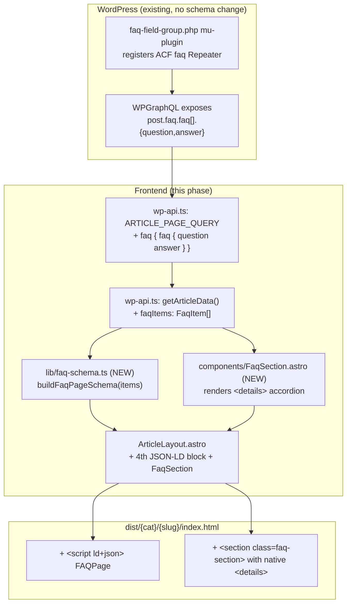

# Design Document — Phase 2.2 FAQ Schema

> Companion to [requirements.md](./requirements.md). High-Level Design + Low-Level Design in one document.
>
> Last updated: 2026-05-19

---

## Overview

Phase 2.2 ships two coordinated frontend deliverables on top of the Phase 1 + 2.1 + 2.3 production baseline:

1. **Additive WPGraphQL change** — extend `ARTICLE_PAGE_QUERY` with a new `faq { faq { question answer } }` block, populate a new `ArticleDetail.faqItems: FaqItem[]` field, mirror existing Repeater handling. **This is the first phase since v1.0 that touches a GraphQL selection set**, but the change is purely additive (no field removed, no field renamed, no existing behavior altered).
2. **Schema.org FAQPage JSON-LD + visible FAQ accordion** — for every article that has ≥ 1 FAQ item, emit a fourth `<script type="application/ld+json">` in `<head>` (after Article + BreadcrumbList + Dataset), and render a `<details>/<summary>` HTML5 accordion section in the article body between Sources and Related Articles.

Hard constraints:

- Zero new client-side JS framework (FAQ accordion uses native `<details>`).
- Zero changes to ACF schema (backend already shipped `faq-field-group.php` mu-plugin with `faq.faq[].{question,answer}` Repeater).
- Build pipeline byte-identical (`prebuild` → `astro build` → `pagefind`).
- Phase 1 + 2.1 + 2.3 verification suites stay green (76 unit + 31 anim + 17 a11y + 7 bundle + 72 verify-related + 5 verify-phase23).
- Single contact email `sangaypopo@gmail.com`. No new third-party origin.
- Graceful degradation when `faq` field is absent (e.g. mu-plugin uninstalled).

---

## Goals & Non-Goals

**In scope (2 work streams)**

- C.1 GraphQL query extension + `ArticleDetail.faqItems` typed pass-through (Req 1)
- C.2 FAQPage JSON-LD emission + visible FAQ accordion section (Req 2 + 3)

**Out of scope (deferred)**

- D4 — `articleMeta.dataSource` removal (Phase 2.x backend cleanup).
- FAQ on non-article pages (homepage, category page).
- Rich-text answers (HTML in answer string). Phase 2.2 treats answer as plain text; future phase can re-enable HTML if backend changes the field type to WYSIWYG.
- Animation / open-by-default heuristics (all `<details>` start collapsed).
- Light theme toggle UI.

---

## Architecture

### High-Level Design — Build-time data flow



### Component map (created / modified / deleted)

| File | Action | Purpose |
|------|--------|---------|
| **Created** | | |
| `src/lib/faq-schema.ts` | new | Pure helper `buildFaqPageSchema(items)` returning a Schema.org FAQPage JSON-LD object. Honors the trim/skip rules from Req 2.6 + 2.7. Returns `null` when no valid items, so caller can skip emitting the `<script>`. |
| `src/lib/faq-schema.test.mjs` | new | Unit tests covering required fields, conditional skipping, deterministic JSON output, byte-identical between two runs. ≥ 8 tests. |
| `src/components/FaqSection.astro` | new | Section with `<h2>Frequently Asked Questions</h2>` and a list of `<details><summary>{q}</summary><div>{a}</div></details>`. Defense-in-depth: returns null when items.length < 1. |
| `baseline/verify-faq.mjs` | new | Post-build assertion script: scans dist/ for the new ld+json block (count + shape) and the visible accordion (heading + details count). |
| **Modified** | | |
| `src/lib/wp-api.ts` | edit | (a) Add `FaqItem` interface; (b) Add `faqItems: FaqItem[]` to `ArticleDetail`; (c) Add `faq { faq { question answer } }` block to `ARTICLE_PAGE_QUERY` (additive); (d) Map `post.faq?.faq?.map(...)` into the result of `getArticleData()`. |
| `src/layouts/ArticleLayout.astro` | edit | (a) Accept `faqItems?: FaqItem[]` prop; (b) Build FAQPage schema via `buildFaqPageSchema()`, emit a 4th `<script ld+json>` after Dataset when non-null; (c) Render `<FaqSection>` between Sources and Related Articles when items exist. |
| `src/pages/[category]/[slug].astro` | edit | Pass `faqItems={article.faqItems}` to `<ArticleLayout>`. |
| `package.json` | edit | Add `src/lib/faq-schema.test.mjs` to `test:phase1` script. |
| `baseline/verify-related.mjs` | edit (minor) | Update head-block ordering assertion to recognize 4 ld+json blocks (Article → BreadcrumbList → Dataset → FAQPage) when faqItems exist; otherwise keep the 3-block assertion. |
| **Deleted** | | None. |

### Decision log

| # | Decision | Chosen | Rejected | Why |
|---|----------|--------|----------|-----|
| §3.1 | Visible FAQ rendering | **Native HTML5 `<details>` / `<summary>`** | Custom React/Vue/Preact accordion | Req 3.5 forbids client JS framework. `<details>` gives keyboard accessibility, focus ring, progressive disclosure for free. Fully indexable by Pagefind (the answer text is in HTML, just inside a collapsed widget). |
| §3.2 | FAQ section placement | **Between Sources and Related Articles**, inside `<article data-pagefind-body>` | Top of article (after Quick Overview) / Sidebar | Bottom placement is the SEO best practice for FAQ schema (matches what Google rich result expects). Inside `data-pagefind-body` keeps Pagefind able to find the answer text. |
| §3.3 | Schema.org omission rule | **Skip Question entries with empty/whitespace question or answer; skip the entire FAQPage block when no valid Question remains** | Emit empty Question objects with placeholder text | Schema validators reject Question without acceptedAnswer.text; emitting placeholders pollutes structured data. Conditional emission keeps the data clean. |
| §3.4 | Answer rendering | **Plain text only** (Astro auto-escapes via `{answer}`) | Render as HTML via `set:html` | Backend currently writes plain text. Allowing HTML opens an XSS vector unless we audit every answer. Future phase can switch to WYSIWYG + sanitizer if needed. |
| §3.5 | FAQPage JSON-LD position | **Article → BreadcrumbList → Dataset → FAQPage** (4th block, append-only) | Replace Article schema with a combined block / reorder | Append-only preserves Phase 2.1's Article + BreadcrumbList + Dataset byte-identical, satisfies Req 5.6, and is the position Google's example shows. |
| §3.6 | New helper module | **Pure TS helper `buildFaqPageSchema(items)` returning the typed object** | Inline JSON construction in ArticleLayout | Testable in isolation. Mirrors Phase 2.1's `buildDatasetSchema` pattern. Fewer lines in the layout. |
| §3.7 | Field name on `ArticleDetail` | **`faqItems: FaqItem[]`** (not `faq: { faq: ... }`) | Mirror the GraphQL nested shape | Frontend types should be flat and ergonomic. The double-nested shape is a wpgraphql-acf artifact. Mirrors how `quickOverview` / `keyTakeaways` / `sources` flatten the WP shape into clean arrays already. |
| §3.8 | Accordion default state | **All `<details>` start collapsed** (no `open` attribute) | First one open by default | Collapsed default keeps initial paint short, gives users full control. SEO impact zero (Google reads ld+json, not the collapsed state). |

### Risk register

| Risk | Likelihood | Impact | Mitigation |
|------|------------|--------|------------|
| `faq-field-group.php` mu-plugin gets uninstalled or its priority reorder breaks the GraphQL field registration → `post.faq` returns null | Low | Low | Req 5.14 mandates graceful degradation. `getArticleData()` uses `post.faq?.faq?.map(...) ?? []` and `ArticleLayout` renders nothing when `faqItems.length === 0`. Build still succeeds. Visible regression: FAQ section + JSON-LD disappear from articles, but no crash. |
| Empty / whitespace question or answer pollutes Schema validator | Medium | Medium | `buildFaqPageSchema()` filters out items where `question.trim() === ''` OR `answer.trim() === ''`. Returns `null` when zero valid items remain (caller skips entire block). Unit-tested. |
| WP backend later changes answer field type from text to WYSIWYG (HTML) | Medium | Medium | Phase 2.2 treats answer as plain text and Astro auto-escapes via `{answer}`. If backend switches type, HTML would render as escaped text (visible `<p>` tags). Not a security risk, but a visual regression. Documented as Phase 2.x follow-up: switch to `cleanExcerpt`-style helper or proper sanitizer + `set:html` once backend confirms HTML is allowed. |
| Pagefind index size grows due to FAQ answers being indexed | Low | Low | FAQ answers are typically 100-500 chars each, ~3-6 per article = ~2KB/article extra index data. Across 46 articles ≈ 100KB extra. Bundle_Verify_Suite re-runs to confirm Pagefind index page count stays ≥ baseline (page count is not the same as size — page count = articles indexed, unaffected). |
| 4th JSON-LD block adds bytes to article HTML | Low | Low | Salesforce sample: 3 questions × ~150B each ≈ 500B uncompressed, ~250B gz. Well under Req 4.6's 5 KB/article gz budget. Verified by `verify-faq.mjs`. |
| `verify-related.mjs` Phase 2.1 assertion expects exactly 3 ld+json blocks (Article + BreadcrumbList + Dataset); after Phase 2.2 articles with FAQ have 4 | High (would break verify-related) | Medium | Update `verify-related.mjs` assertion: "last 3 of {Article, BreadcrumbList, Dataset, FAQPage} present" → "Article + BreadcrumbList + Dataset + (optional FAQPage) present in that order, total 3 or 4 ld+json content blocks under article-page (excluding the BaseLayout's Organization). |

---

## Components and Interfaces

### Low-Level Design — `src/lib/faq-schema.ts` (new)

```ts
/**
 * Phase 2.2 — Schema.org FAQPage JSON-LD builder.
 *
 * Pure helper. SSG-friendly: no DOM, no I/O, fully deterministic.
 *
 * Implements requirements.md §2.3-2.7 conditional emission rules and
 * §2.11 determinism.
 *
 * Reference:
 *   - https://schema.org/FAQPage
 *   - https://developers.google.com/search/docs/appearance/structured-data/faqpage
 */

export interface FaqItem {
  question: string;
  answer: string;
}

export interface FaqPageSchema {
  '@context': 'https://schema.org';
  '@type': 'FAQPage';
  mainEntity: Array<{
    '@type': 'Question';
    name: string;
    acceptedAnswer: { '@type': 'Answer'; text: string };
  }>;
}

/**
 * Build a FAQPage JSON-LD object. Returns null when no valid items remain
 * after filtering, so the caller can skip emitting the <script> entirely.
 */
export function buildFaqPageSchema(items: FaqItem[]): FaqPageSchema | null {
  if (!Array.isArray(items) || items.length === 0) return null;

  const mainEntity = items
    .map((item) => ({
      question: typeof item?.question === 'string' ? item.question.trim() : '',
      answer: typeof item?.answer === 'string' ? item.answer.trim() : '',
    }))
    .filter((it) => it.question.length > 0 && it.answer.length > 0)
    .map((it) => ({
      '@type': 'Question' as const,
      name: it.question,
      acceptedAnswer: { '@type': 'Answer' as const, text: it.answer },
    }));

  if (mainEntity.length === 0) return null;

  return {
    '@context': 'https://schema.org',
    '@type': 'FAQPage',
    mainEntity,
  };
}
```

### `src/components/FaqSection.astro` (new)

```astro
---
/**
 * Phase 2.2 — FAQ accordion section.
 *
 * Renders a heading + a list of native HTML5 <details><summary> items.
 * NEVER renders an empty state — the caller (ArticleLayout) is
 * responsible for not mounting this component when items.length < 1.
 *
 * Reqs: 3.1, 3.3-3.10
 */
import type { FaqItem } from '../lib/faq-schema';

interface Props {
  items: FaqItem[];
}

const { items } = Astro.props;

// Defense-in-depth: same trim/skip rule as faq-schema.ts so the visible
// accordion exactly matches the JSON-LD content.
const renderable = (items ?? [])
  .map((it) => ({
    question: typeof it?.question === 'string' ? it.question.trim() : '',
    answer: typeof it?.answer === 'string' ? it.answer.trim() : '',
  }))
  .filter((it) => it.question.length > 0 && it.answer.length > 0);
---

{renderable.length > 0 && (
  <section
    class="faq-section mt-12 pt-8 border-t border-border"
    aria-labelledby="faq-section-heading"
  >
    <h2 id="faq-section-heading" class="font-section-heading text-2xl mb-6">
      Frequently Asked Questions
    </h2>
    <div class="space-y-3">
      {renderable.map((item) => (
        <details class="faq-item bg-surface rounded-lg border border-border">
          <summary class="cursor-pointer font-semibold p-4 select-none">
            {item.question}
          </summary>
          <div class="px-4 pb-4 pt-1 text-text-secondary leading-relaxed">
            {item.answer}
          </div>
        </details>
      ))}
    </div>
  </section>
)}
```

### `src/lib/wp-api.ts` (edit, additive only)

Three small changes near existing field handling:

```ts
// 1. New interface near other Repeater item types
export interface FaqItem {
  question: string;
  answer: string;
}

// 2. Add to ArticleDetail interface (additive field, end of definition)
export interface ArticleDetail {
  // ... existing fields unchanged ...
  faqItems: FaqItem[];      // NEW Phase 2.2
}

// 3. Append to ARTICLE_PAGE_QUERY between `sources { ... }` and the closing brace
//    Existing query order: articleMeta, quickOverviewItems, keyTakeaways, sources
//    New order:            articleMeta, quickOverviewItems, keyTakeaways, sources, faq
const ARTICLE_PAGE_QUERY = `
query ArticlePageData($slug: ID!) {
  post(id: $slug, idType: SLUG) {
    # ... existing fields unchanged ...
    sources { sources { name title date url } }
    faq { faq { question answer } }   # ← NEW Phase 2.2
  }
}
`;

// 4. In getArticleData(), populate the new field, mirroring sources/keyTakeaways pattern:
faqItems: post.faq?.faq?.map((item: any) => ({
  question: item.question || '',
  answer: item.answer || '',
})) || [],
```

### `src/layouts/ArticleLayout.astro` (edit)

```astro
---
import FaqSection from '../components/FaqSection.astro';
import { buildFaqPageSchema } from '../lib/faq-schema';
import type { FaqItem } from '../lib/faq-schema';

interface Props {
  // ... existing fields unchanged ...
  faqItems?: FaqItem[];   // NEW
}

const {
  // ... existing destructuring ...
  faqItems = [],
} = Astro.props;

// Existing articleSchema, breadcrumbSchema, datasetSchema, categoryMeta unchanged.
// NEW Phase 2.2: build FAQ schema (may be null)
const faqPageSchema = buildFaqPageSchema(faqItems);
---

<BaseLayout ...>
  <!-- ... existing slots and structured data ... -->
  <script type="application/ld+json" set:html={JSON.stringify(articleSchema)} />
  <script type="application/ld+json" set:html={JSON.stringify(breadcrumbSchema)} />
  <script type="application/ld+json" set:html={JSON.stringify(datasetSchema)} />
  {faqPageSchema && (
    <script type="application/ld+json" set:html={JSON.stringify(faqPageSchema)} />
  )}

  <div class="max-w-[1200px] mx-auto px-6 py-8">
    <!-- ... existing breadcrumb and content ... -->
    <article class="article-content flex-1 min-w-0" data-pagefind-body>
      <!-- ... title, cover, mobile TOC, QuickOverview, body, KeyTakeaways, Sources unchanged ... -->

      {sources.length > 0 && <Sources sources={sources} />}

      {/* NEW Phase 2.2: FAQ section between Sources and Related Articles */}
      {faqItems.length > 0 && <FaqSection items={faqItems} />}

      {relatedTiles.length >= 3 && <RelatedArticles tiles={relatedTiles} />}

      <div class="mt-8"><Newsletter /></div>
    </article>
    <!-- ... aside unchanged ... -->
  </div>
</BaseLayout>
```

### `src/pages/[category]/[slug].astro` (edit)

Pass through one new prop:

```astro
<ArticleLayout
  ...existing props...
  relatedTiles={relatedTiles}
  faqItems={article.faqItems}   {/* NEW */}
>
```

### `baseline/verify-faq.mjs` (new)

Post-build assertion suite. Auto-discovers articles, asserts that articles with FAQ data have:

1. Exactly one `<script type="application/ld+json">` whose parsed `@type === "FAQPage"`.
2. The block's `mainEntity` array length matches the visible `<details>` count in the section.
3. Each Question's `name` and `acceptedAnswer.text` matches the corresponding `<summary>` and `<div>` text in the visible accordion.
4. `<section class="faq-section">` exists with `aria-labelledby="faq-section-heading"`.
5. Heading is `<h2 id="faq-section-heading">Frequently Asked Questions</h2>`.
6. The 4 ld+json blocks per article appear in order: Article → BreadcrumbList → Dataset → FAQPage.
7. Articles WITHOUT FAQ data do not have the section nor the FAQPage block.

---

## Data Models

### New types

```ts
// src/lib/faq-schema.ts
export interface FaqItem { question: string; answer: string; }
export interface FaqPageSchema { /* see §LLD */ }

// src/lib/wp-api.ts
// Added to ArticleDetail (additive):
faqItems: FaqItem[];
```

### Updated types (additive only)

`ArticleLayout` Props gains `faqItems?: FaqItem[]`. No existing field on any interface is removed or renamed.

No changes to `ArticleCard`, `Category`, `HomePageData`, `CategoryPageData`, `QuickOverviewItem`, `KeyTakeaway`, `SourceItem`.

---

## Error Handling

| Surface | Failure mode | Behavior | Req coverage |
|---|---|---|---|
| `post.faq` is missing from GraphQL response | mu-plugin uninstalled, schema regression | `getArticleData()` returns `faqItems: []`. ArticleLayout skips both the JSON-LD block and the visible section. Build succeeds. | 5.14 |
| `post.faq.faq` is null or non-array | ACF returns malformed Repeater | Optional chaining + `?? []` fallback yields `faqItems: []`. Same outcome as above. | 1.5, 5.14 |
| One FAQ_Item has empty question or empty answer | Editor saved a partial entry | `buildFaqPageSchema` filters it out of `mainEntity`. `FaqSection` does the same filter for the visible accordion. Both stay in sync (Req 3.8). | 2.6, 2.7, 3.8 |
| All FAQ items have empty fields | Editor created empty rows | `buildFaqPageSchema` returns null → no `<script>` emitted. `FaqSection` skips rendering. | 2.6, 2.7, 3.2 |
| Answer string contains `<` or `>` characters | Legacy editor content | Astro auto-escapes via `{answer}` — renders as visible HTML entities, never executes. | 3.7 |

---

## Correctness Properties

### Property 1: Build Determinism

Two consecutive `npm run build` runs against the same WordPress state produce byte-identical `dist/` output for the FAQPage JSON-LD block and the FaqSection HTML on every article page. Verified by unit tests (`buildFaqPageSchema` is a pure function over a typed input) and by `diff dist/` of two builds.

**Validates: Requirements 2.11**

### Property 2: GraphQL Selection-Set Additivity

`git diff src/lib/wp-api.ts` shows zero changes to existing query string literals (`HOME_PAGE_QUERY`, `CATEGORY_PAGE_QUERY`, `ALL_SLUGS_QUERY`, `ALL_CATEGORIES_QUERY`, `SITEMAP_QUERY`, `POSTS_BY_SLUGS_QUERY`, `SITE_CONFIG_QUERY`). The only diff to a query literal is one new line `faq { faq { question answer } }` appended inside `ARTICLE_PAGE_QUERY` between `sources { ... }` and the closing brace.

**Validates: Requirements 1.1, 1.2, 1.6, 5.9**

### Property 3: JSON-LD Additivity

The post-phase Article_Page `<head>` is a strict superset of the pre-phase `<head>`: every Article_Schema, BreadcrumbList_Schema, Dataset_Schema field plus every OG/Twitter/canonical/GA4/Consent/Organization block remains byte-identical. Articles with FAQ items get one new `<script ld+json>` FAQPage block appended after Dataset; articles without FAQ items have the same 3-block layout as before.

**Validates: Requirements 2.1, 2.8, 2.9, 5.6**

### Property 4: Phase 1 + 2.1 + 2.3 Contract Preservation

All prior verification suites stay green: 76 unit + 31 anim + 17 a11y + 7 bundle + 72 verify-related + 5 verify-phase23. Token names, animation hooks, contrast tiers unchanged. Lighthouse scores Δ within budget.

**Validates: Requirements 4.1, 4.2, 4.3, 4.4, 4.5, 4.6, 4.7**

### Property 5: Visible-Section ↔ JSON-LD Byte Match

For every article that has FAQ items, the visible `<details><summary>{q}</summary><div>{a}</div></details>` content is byte-equivalent (after the same trim/skip rules) to the corresponding entry in the FAQPage JSON-LD `mainEntity[i].name` and `mainEntity[i].acceptedAnswer.text`. This means readers see exactly what Google's rich result will show.

**Validates: Requirements 3.8**

### Property 6: Empty-State Safety

When `faqItems` is empty (or all items have empty fields after trimming), neither the JSON-LD block nor the visible accordion is rendered — no heading, no empty container, no orphan `<script>`. Defense-in-depth applied at three levels: (a) `buildFaqPageSchema()` returns null; (b) `ArticleLayout` checks `faqItems.length > 0` before mounting; (c) `FaqSection.astro` filters and early-returns if zero renderable.

**Validates: Requirements 2.2, 2.6, 2.7, 3.2**

### Property 7: Graceful Degradation Without Backend Field

If `faq-field-group.php` mu-plugin is uninstalled or returns an unexpected shape, `getArticleData()` still succeeds with `faqItems: []`, and the article renders normally without FAQ content. No build failure, no crash, no error in browser console.

**Validates: Requirements 5.14**

### Property 8: No New Origin / Email / Framework

`package.json` shows no new `dependencies` / `devDependencies`. No new third-party origin. Single contact email `sangaypopo@gmail.com` everywhere.

**Validates: Requirements 5.8, 5.10, 5.11**

---

## Testing Strategy

> Phase 2.2 reuses the prior verification harness pattern: pure-helper unit tests via `node --test` wired into `npm run test:phase1`, plus post-build verify scripts on `dist/`, plus Lighthouse regression on production.
>
> New unit suite: `src/lib/faq-schema.test.mjs` (≥ 8 tests covering required fields, conditional emission, deterministic JSON, empty-input handling, malformed-input handling). Total grows from 76 to ≥ 84.
>
> New post-build script: `baseline/verify-faq.mjs` asserts FAQPage block presence, structure, and visible-section ↔ JSON-LD byte match.
>
> Existing scripts (`verify-animations.mjs`, `verify-a11y.mjs`, `verify-bundle.mjs`, `verify-related.mjs`, `verify-phase23-internal-links.mjs`) re-run unchanged. `verify-related.mjs` gets a small update to recognize 4 ld+json blocks (instead of strict 3) on articles with FAQ.
>
> Lighthouse regression: home + article × desktop + mobile, compared against Pre_Phase_2_2_Baseline (= post-Phase-2.3 production scores). Budgets: Perf Δ ≥ −5, A11y Δ ≥ 0, mobile-home LCP Δ ≤ +200ms.
>
> Schema validation: Google Rich Results Test + Schema.org validator, manually run against the test article (Salesforce, 3 FAQ items already populated).
>
> Per-requirement test mapping in section "Verification Matrix" below.

---

## Verification Matrix

| Req | Check | Method |
|---|---|---|
| 1.1, 1.2, 1.6 | `ARTICLE_PAGE_QUERY` only adds the new `faq` block; other queries byte-identical | `git diff src/lib/wp-api.ts` pre-merge gate |
| 1.3, 1.4, 1.5 | `ArticleDetail.faqItems` populated correctly | runtime test via `getArticleData('salesforce-statistics-2026')` returns 3 items; mock-data fallback returns `[]` |
| 2.1-2.10 | FAQPage block shape correctness, conditional emission | `faq-schema.test.mjs` (≥ 8 tests) + `verify-faq.mjs` |
| 2.11 | Determinism | unit test "two builds produce identical JSON" + manual `diff dist/` |
| 3.1-3.10 | Visible accordion correctness | `verify-faq.mjs` post-build assertions |
| 3.6 | Heading contrast ≥ 4.5:1 | inherits `.font-section-heading` from Phase 1; `verify-a11y.mjs` already validates Phase 1 token contrast |
| 4.1-4.7 | Prior suites preserved | re-run all 6 verify scripts + Lighthouse |
| 4.8 | Changelog auditable | `changelog.md` lists deltas |
| 5.1-5.13 | Build / deploy / compatibility | `npm run build` + post-build assertion |
| 5.14 | Graceful degradation | runtime test with mocked GraphQL response missing the `faq` field |

---

## Deployment & Rollback

### Deployment

1. Capture Pre_Phase_2_2_Baseline: re-run `node baseline/extract-head.mjs` (using current dist) + `node baseline/capture-pre-phase21.mjs` (rename outputs to pre-phase22-*) + 4 verify scripts + `verify-phase23-internal-links` + Lighthouse 4 profiles.
2. Implement Phase 2.2 on a feature branch.
3. Run `npm run build` locally; confirm exit 0, Pagefind page count ≥ baseline, all 6+1 verify scripts green.
4. Open PR, merge to `main`, Cloudflare Pages auto-deploys.
5. Smoke test: visit Salesforce article, view-source, confirm 4 ld+json blocks (`@type` Article, BreadcrumbList, Dataset, FAQPage), visible FAQ accordion with 3 items, all 3 questions match the JSON-LD `mainEntity[].name`.
6. Run Google Rich Results Test on the Salesforce article URL: 0 errors, FAQPage detected.
7. Run post-deploy Lighthouse on home + article × desktop + mobile. Confirm budgets.
8. Update `changelog.md` with deltas.

### Rollback

If post-deploy Lighthouse breaches budgets, JSON-LD validator errors, or any production smoke check fails: `git revert <merge-commit>` on `main`. Cloudflare Pages auto-redeploys prior commit. Backend mu-plugin stays in place (it doesn't affect prior phases). Fully reversible.

---

## Phase Sign-off Criteria

- [ ] All 5 Requirements / ~50 acceptance criteria satisfied.
- [ ] `npm run build` exits 0 in ≤ 600s.
- [ ] `npm run test:phase1` exits 0 (≥ 84 total tests).
- [ ] All 6 prior verify scripts + new `verify-faq.mjs` pass.
- [ ] Lighthouse home + article × desktop + mobile within budget vs Pre_Phase_2_2_Baseline.
- [ ] Schema.org Dataset + FAQPage validators report 0 errors on Salesforce article.
- [ ] `dist/pagefind/` page count ≥ baseline.
- [ ] `git diff src/lib/wp-api.ts` shows the additive faq block only.
- [ ] `git diff package.json` shows no new dependencies (only test:phase1 script update).
- [ ] No `<html>` `lang` change. No new contact email. No new third-party origin.
- [ ] `changelog.md` populated.
