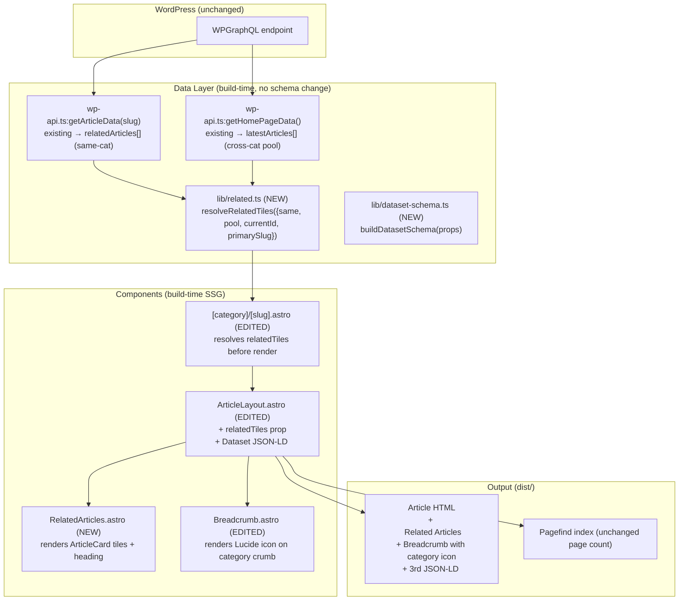
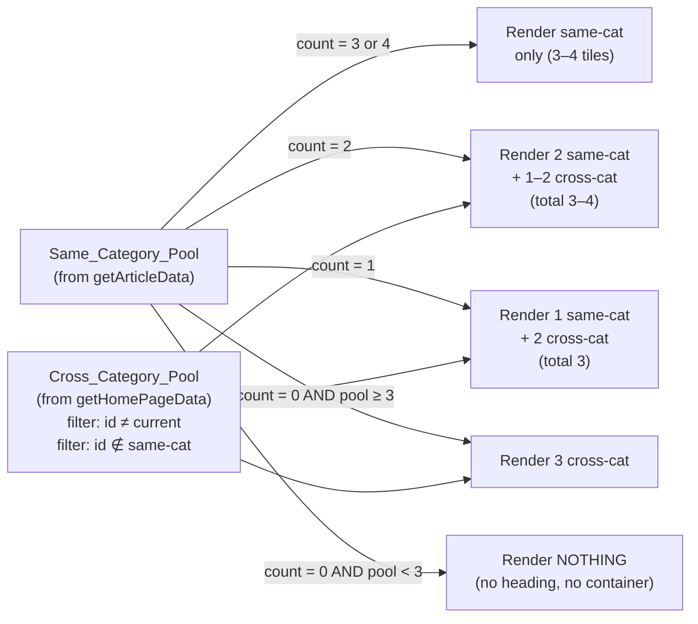
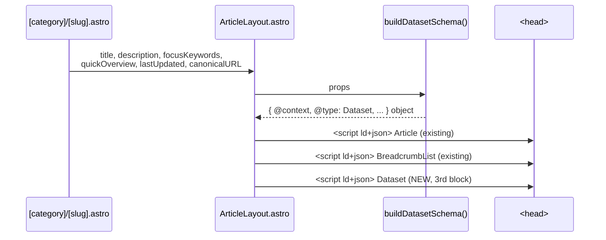

# Design Document — Phase 2.1 SEO Quick Wins

> Companion to [requirements.md](./requirements.md). High-Level Design + Low-Level Design in one document.
>
> Last updated: 2026-05-18

---

## Overview

Phase 2.1 ships three coordinated, frontend-only SEO improvements on top of the Phase 1 — Visual System Uplift baseline (shipped 2026-05-17):

1. **Related Articles module** rendered between Sources and the bottom Newsletter on every Article_Page, with a deterministic same-category-first / cross-category-fill strategy that meets the Req 1 thresholds (3–4 tiles, no empty container).
2. **Breadcrumb visual consistency** — the existing `<Breadcrumb>` component gets a Lucide category icon on the second crumb (resolved through `metaFor()`), keeping the visible trail byte-consistent in label order with the existing `BreadcrumbList` JSON-LD.
3. **Schema.org Dataset JSON-LD** injected as a third `<script type="application/ld+json">` block in `ArticleLayout`'s `<head>`, sibling to the existing Article and BreadcrumbList blocks (never replacing them), with deterministic field ordering and a CC BY-NC 4.0 license.

Hard constraints (carried from Phase 1, restated by Req 5):

- No new client-side JS framework (React/Vue/Preact/Solid/Svelte).
- Zero changes to WPGraphQL queries, ACF schema, or any existing GraphQL selection set.
- Build pipeline unchanged: `prebuild` (font copy) → `astro build` → `pagefind --site dist`.
- Phase 1 verification suite stays green (51 unit + 31 anim + 16 a11y + 7 bundle + 12 Lighthouse).
- Single contact email `sangaypopo@gmail.com`. No new third-party origin.

The rest of this document spells out the architecture, the per-file change list, the new helper modules, the JSON-LD shape, the verification matrix, and the risk register.

---

## 1. Goals & Non-Goals

**In scope (3 work streams)**

- B.1 Related Articles module on every Article_Page (Req 1)
- B.2 Breadcrumb visual ↔ JSON-LD parity + Lucide category icon (Req 2)
- B.3 Schema.org Dataset JSON-LD on every Article_Page (Req 3)

**Out of scope (explicitly deferred)**

- FAQ Schema (Phase 2.2 — needs ACF `faq` Repeater backend).
- Internal anchor-text tooling and audit (Phase 2.3).
- Root-cause fix for `articleMeta.primaryCategory` returning `null` (Phase 2.2-D3, backend mu-plugin).
- Removal of the deprecated `articleMeta.dataSource` field (Phase 2.2-D4, backend ACF cleanup).
- Light-theme toggle UI (Phase 2.x or later).
- Any new runtime client-side JavaScript framework.

---

## Architecture

> High-Level Design follows. Section 2 below contains the build-time data flow, fill strategy, sourcing, JSON-LD emission sequence, component map, decision log, and risk register.

### 2. Architecture (High-Level Design)

### 2.1 Build-time data flow



### 2.2 Related Articles fill strategy



### 2.3 Cross-category pool sourcing (no new query)

The `Cross_Category_Pool` is sourced exclusively from the existing `HOME_PAGE_QUERY` (lines 255–301 of `src/lib/wp-api.ts`), which already pulls `posts(first: 15)` with `id`, `title`, `slug`, `excerpt`, `date`, `featuredImage`, `categories`, and `articleMeta.readTime`. We add a new exported helper `getRecentArticlesAcrossCategories()` that calls `HOME_PAGE_QUERY` and returns `ArticleCard[]` (transformed via the existing `transformArticleCard`). No selection set mutation, no new variable, no new query string. The 15-post window is sufficient for cross-category fill in the worst observed case (Same_Category_Pool = 0 → need 3 cross-cat tiles; production has 25 published posts across 8 categories).

### 2.4 Dataset JSON-LD emission



### 2.5 Component map (created / modified / deleted)

| File | Action | Purpose |
|------|--------|---------|
| **Created** | | |
| `src/components/RelatedArticles.astro` | new | Section wrapper that renders the heading + responsive grid + 3–4 `<ArticleCard>` tiles. Pure SSG. No client JS. |
| `src/lib/related.ts` | new | Pure helper `resolveRelatedTiles({...})` implementing the count-based fill rules in Req 1.3–1.7. Deterministic, no I/O. |
| `src/lib/related.test.mjs` | new | Unit tests covering the 5 fill cases + sort stability + cross-cat dedupe. Wired into `npm run test:phase1` so the Unit_Test_Suite count increases by N. |
| `src/lib/dataset-schema.ts` | new | Pure helper `buildDatasetSchema(props)` that returns the typed Dataset JSON-LD object honoring Req 3.2–3.13 conditional emission rules. |
| `src/lib/dataset-schema.test.mjs` | new | Unit tests covering keyword splitting, conditional field omission, deterministic ordering. Wired into `npm run test:phase1`. |
| **Modified** | | |
| `src/lib/wp-api.ts` | edit | Add `getRecentArticlesAcrossCategories(): Promise<ArticleCard[]>`. Reuses `HOME_PAGE_QUERY` byte-identical. No selection-set change. |
| `src/components/Breadcrumb.astro` | edit | Add optional `iconName?: string` slot per crumb; render `<Icon>` immediately before label when set. Unchanged when not set (homepage / category-page breadcrumbs unaffected). |
| `src/layouts/ArticleLayout.astro` | edit | (a) Build & emit Dataset JSON-LD `<script>` after the existing two; (b) accept new `relatedTiles?: ArticleCard[]` prop and render `<RelatedArticles>` between Sources and bottom Newsletter when ≥ 3; (c) pass `iconName` to the second crumb when category resolves to a known meta. |
| `src/pages/[category]/[slug].astro` | edit | After `getArticleData(slug)`: call `resolveRelatedTiles({...})`, pass `relatedTiles` to `<ArticleLayout>`. Catch fetch failures on the cross-cat pool and degrade gracefully (use same-cat only). |
| `package.json` | edit | No new dependencies required. Bumps test:phase1 count if applicable. |
| **Deleted** | | None. |

> Reference: existing `relatedArticles[]` is already populated by `getArticleData()` at `wp-api.ts:518–536` (same-category source via `categories.nodes[].posts.nodes`). It already excludes the current article (`related.id !== post.id`) and dedupes (`!relatedArticles.find(r => r.id === related.id)`). It is currently unused in `ArticleLayout` — Phase 2.1 wires it through.


### 2.6 Decision log

| # | Decision | Chosen | Rejected | Why |
|---|----------|--------|----------|-----|
| §3.1 | Cross-category pool source | **Reuse `HOME_PAGE_QUERY` via a new exported `getRecentArticlesAcrossCategories()` returning the 15-post window** | (a) Add a new `RECENT_POSTS_QUERY`; (b) extend `HOME_PAGE_QUERY` with a `first: 30` arg; (c) walk all 8 categories and merge | Req 5.9 forbids any GraphQL selection-set change. Production has 25 posts; the existing 15-post window is enough to find 3 cross-cat candidates in the worst case (Same_Category_Pool = 0). The function is a pure transformation of the same query response, byte-identical query string. Tradeoff accepted: when total post count grows past ~50 with very uneven category distribution, we may need to bump the window — that's a Phase 3 problem, not a 2.1 blocker. |
| §3.2 | Empty-state UI | **Hide the entire Related Articles section (no heading, no placeholder, no empty container) when resolved tile count is < 3** | (a) Render heading + "More articles coming soon" empty-state; (b) Render heading with 1–2 tiles | Req 1.7 locked this in spec phase. Empty states with sparse content actively hurt SEO (thin-content signal). Production article distribution makes 0 tiles vanishingly rare (only HR has 1 post; cross-cat fill produces 3 tiles in that case). |
| §3.3 | Cross-category sort key | **Publish date descending; article id as deterministic tiebreaker** | (a) Random shuffle; (b) Featured/sticky boost | Req 1.11 locks deterministic. Build-time SSG must be reproducible — two consecutive `npm run build` runs against the same WP state must produce byte-identical HTML so Cloudflare Pages cache invalidation is correct and so Lighthouse audits don't flap on noise. Sort key uses `rawDate` (ISO from WP) which `transformArticleCard` already populates. |
| §3.4 | Related card render component | **Reuse `ArticleCard.astro` as-is, no prop changes** | (a) Build a slim `RelatedCard` variant; (b) Inline a custom card markup | Req 1.2 forbids modifying `ArticleCard`. The same shape (cover, tag, title, excerpt, date, read-time) is what readers already trust visually elsewhere on the site. The fact that `relatedArticles` placeholder values for `excerpt='', date=''` from the same-cat source render as empty space below the title is acceptable; Req 1.2 does not mandate populated excerpts. The cross-category pool entries do carry full excerpts/dates because they come from `transformArticleCard()`. |
| §3.5 | Breadcrumb icon prop shape | **Optional `iconName?: string` per crumb in the `crumbs` prop array** | (a) New `<BreadcrumbWithIcons>` component; (b) Mandatory `iconName` on every crumb | Smallest diff. Existing call sites (homepage, category page) pass crumbs without `iconName` and continue to render unchanged. Only `ArticleLayout` opts in by setting `iconName` on the category crumb (resolved via `metaFor()`). Req 2.12 fallback is automatic since `metaFor()` already returns `FALLBACK_META` when category doesn't resolve. |
| §3.6 | Dataset JSON-LD module | **Pure TS helper `buildDatasetSchema(props)` returning a plain object** | Inline JSON construction in `ArticleLayout` | Testable in isolation (Req 3.6 keyword splitting, Req 3.7/3.11/3.13 conditional omission). Unit-tested with `node --test` like Phase 1's `sparkline.ts`. Layout file stays readable. |
| §3.7 | Dataset `keywords` shape | **JSON array of strings (not comma-joined string)** | Comma-joined string per Schema.org spec | Schema.org Dataset accepts both, but the array form is unambiguous to validators and matches Google's [Dataset Search guidance](https://developers.google.com/search/docs/appearance/structured-data/dataset). When `Focus_Keywords_String` is empty, the field is omitted entirely (Req 3.7). |
| §3.8 | Dataset `temporalCoverage` format | **Pass `articleMeta.lastUpdated` through verbatim as a string when present, omit when empty** | (a) Coerce to ISO 8601; (b) Synthesize from `datePublished`/`dateModified` | The WP backend currently emits `lastUpdated` as a free-text string ("2026-04-12" in the seed posts). Schema.org `temporalCoverage` accepts ISO 8601 dates and date intervals as strings — passing through is honest. If editors enter freeform values, Schema.org validators may flag a soft warning but won't error; we accept this tradeoff for Phase 2.1 and revisit in Phase 2.2 alongside the ACF cleanup (D4). |
| §3.9 | Dataset `creator` shape | **`Organization` with name=SaaSStatsHub and url=site origin, mirroring Article publisher** | Person-typed creator | The site operates as an organization, not an individual byline. Mirrors `articleSchema.publisher` for consistency across the three JSON-LD blocks. |
| §3.10 | Dataset block ordering in `<head>` | **Article → BreadcrumbList → Dataset** | Any other order | Req 3.14 locks this. Existing two blocks stay byte-identical in their current order (Req 5.6); Dataset becomes a strict append. |
| §3.11 | Cross-cat pool failure mode | **On `getRecentArticlesAcrossCategories()` throw, fall back to same-cat-only resolution** | Fail the build | The build cannot tolerate a transient WP rate-limit on the cross-cat fetch when the same-cat data already succeeded. The fallback degrades to same-cat-only, which obeys Req 1.7 (hide if < 3 tiles). The build still succeeds. A console.warn surfaces the issue for the operator. |

### 2.7 Risk register

| Risk | Likelihood | Impact | Mitigation |
|------|------------|--------|------------|
| `Same_Category_Pool` source `relatedArticles[]` has empty `excerpt` and `date` (placeholder values) — same-cat tiles render with blank lines | **High (existing behavior)** | Low | Visual blanks below the title in `<ArticleCard>` are already in production (the field is wired but never had data populated). Phase 2.1 does not regress this. Phase 2.2 can extend the same-cat source to populate excerpts via the same `transformArticleCard` shape used by cross-cat. Documented in changelog as a known follow-up. |
| Cross-cat pool of 15 posts is insufficient when site grows past ~80 posts with skewed distribution | Low (today) | Medium (later) | The 15-post window covers the current 25-post production state with 3× headroom. A guard log emits when cross-cat pool runs out (`pool.length < required`). Phase 3 can bump the `HOME_PAGE_QUERY` `posts(first: 15)` value once we have backend agreement (selection set unchanged, only argument value changes — would still satisfy Req 5.9 reading). |
| Dataset JSON-LD validation fails on the Schema.org validator due to `temporalCoverage` freeform string | Low | Low | Conditional omission (Req 3.11) means absent or empty values never emit. Production seed posts have `lastUpdated="2026-04-12"` which validates as ISO 8601 date (YYYY-MM-DD). Phase 2.1 changelog runs the validator against one article from each of 8 categories (Req 3.15) before merge. |
| Adding the Dataset block changes the `<head>` byte-length and cascades into Lighthouse Performance regressions | Low | Low | Dataset block ≈ 600–900 bytes per article (uncompressed). Gzipped, the increment is < 0.5 KB per page. Well within the Req 4.11/4.12 5 KB JS budget (which is even stricter than HTML payload). Verified by `baseline/measure-js-payload.mjs` post-phase. |
| `getRecentArticlesAcrossCategories()` triggers a second WP fetch per article page → multiplies build time | Medium | Medium | Astro `getStaticPaths` is the right cache scope but fires once per page module. We memoize the cross-cat fetch via a module-level `Promise` so the fetch happens at most once per build (`memoizedRecentArticles ??= fetchOnce()`). Build time impact: +1 fetch total (~0.3s), not +25 fetches (one per page). |
| `Breadcrumb.astro` change breaks homepage/category-page breadcrumb rendering | Low | High (visual regression all over) | Optional prop pattern (`iconName?: string`). Existing call sites pass crumbs without `iconName` → render path unchanged (no `<Icon>` emitted). Manual sweep grep: `grep -rn "<Breadcrumb"` in `src/` to enumerate all callers. |
| `relatedTiles` rendered between Sources and Newsletter changes existing reading-progress and TOC anchors | Low | Low | The new `<section id="related-articles">` becomes a new TOC anchor candidate. We do **not** add it to `tocItems` (per Req 1.12 the `<h2>` heading is "Related Articles" but TOC building runs from `<h2 id="...">` regex on `article.content`, not on the layout shell — so TOC stays unchanged). Reading-progress observes `.article-body` (existing scroll target) and is unaffected. |
| Astro 6 `<svg>` emission via `Icon.astro` on the breadcrumb fails the Phase 1 `Icon_Component` build-fail-on-unknown rule when category resolves to `FALLBACK_META.iconName="bar-chart-3"` (which is registered) | Low | Low | `bar-chart-3` is in `ICON_REGISTRY`. The 8 production category icons (`users`, `megaphone`, `shopping-cart`, `clipboard-list`, `user-cog`, `bar-chart-3`, `shield`, `message-square`) are all registered. No new icon names introduced. Verified by `verify-bundle.mjs` re-run. |
| Pagefind picks up the new `<section>` as searchable content and inflates the per-page index size | Low | Low | The new section renders inside `<article data-pagefind-body>` indeed (it's a child of the layout's main content wrapper). However, the related-tile contents are already searchable in their own pages, so the marginal index size growth is bounded (each tile contributes ≈ 50 bytes of title text). Bundle_Verify_Suite re-runs to confirm `≥` baseline page count and JS size budget. |

---

## Components and Interfaces

> Low-Level Design follows. Section 3 below specifies the new modules (`related.ts`, `dataset-schema.ts`, `RelatedArticles.astro`), the additive `wp-api.ts` export, and the surgical edits to `Breadcrumb.astro`, `ArticleLayout.astro`, and `[category]/[slug].astro`.

### 3. Components and Interfaces (Low-Level Design)

This section is the implementation contract. Each new module is given as TypeScript / Astro pseudocode at a level of detail an engineer can drop in.

### 3.1 `src/lib/related.ts` (new)

```ts
/**
 * Pure helper that resolves the final list of Related Articles tiles for an
 * Article_Page, given the same-category pool from getArticleData() and the
 * cross-category pool from getRecentArticlesAcrossCategories().
 *
 * Implements Req 1.3–1.11. SSG-friendly: no DOM, no I/O, fully deterministic.
 */
import type { ArticleCard } from './wp-api';

export interface ResolveRelatedArgs {
  /** Same-category candidates already in `getArticleData().relatedArticles`. */
  sameCategory: ArticleCard[];
  /** Cross-category candidates from getRecentArticlesAcrossCategories(). */
  crossCategoryPool: ArticleCard[];
  /** The current article id, used to exclude self from cross-cat pool. */
  currentArticleId: string;
  /** Primary category slug of the current article, used to exclude same-cat from cross-cat pool. */
  currentPrimaryCategorySlug: string;
}

/**
 * Returns the final list of tiles to render, in render order:
 *   - same-category entries first (preserving input order)
 *   - then cross-category entries (sorted by date desc, id asc tiebreaker)
 *
 * Returns [] when the resolved count is < 3 (caller renders nothing — Req 1.7).
 */
export function resolveRelatedTiles(args: ResolveRelatedArgs): ArticleCard[] {
  const { sameCategory, crossCategoryPool, currentArticleId, currentPrimaryCategorySlug } = args;

  const sameCount = sameCategory.length;

  // Branch 1: same-cat already 3 or 4 → no cross-cat fill (Req 1.3)
  if (sameCount >= 3) {
    return sameCategory.slice(0, 4);
  }

  // Build the cross-cat candidate set (Req 1.10):
  //   - exclude current article
  //   - exclude any id present in same-cat
  //   - exclude any post whose primary category slug matches current
  const sameIds = new Set(sameCategory.map((a) => a.id));
  const crossCandidates = crossCategoryPool
    .filter((a) => a.id !== currentArticleId)
    .filter((a) => !sameIds.has(a.id))
    .filter((a) => a.category.slug !== currentPrimaryCategorySlug);

  // Sort: publish date desc, then id asc as deterministic tiebreaker (Req 1.11)
  const sortedCross = [...crossCandidates].sort((a, b) => {
    const ad = a.rawDate ? Date.parse(a.rawDate) : 0;
    const bd = b.rawDate ? Date.parse(b.rawDate) : 0;
    if (bd !== ad) return bd - ad;
    return a.id < b.id ? -1 : a.id > b.id ? 1 : 0;
  });

  // Compute fill quota per Req 1.4–1.6
  let need: number;
  if (sameCount === 2)      need = Math.min(2, sortedCross.length);   // total 3 or 4 (Req 1.4)
  else if (sameCount === 1) need = 2;                                 // total 3 (Req 1.5)
  else                       need = 3;                                // sameCount === 0, total 3 (Req 1.6)

  const crossFill = sortedCross.slice(0, need);
  const merged = [...sameCategory, ...crossFill];

  // Hide entirely if final count < 3 (Req 1.7)
  if (merged.length < 3) return [];
  return merged;
}
```

### 3.2 `src/lib/related.test.mjs` (new)

```js
import { test } from 'node:test';
import assert from 'node:assert/strict';
import { resolveRelatedTiles } from './related.ts';

const mk = (id, catSlug, date = '2026-04-01') => ({
  id, title: `Article ${id}`, slug: `slug-${id}`,
  excerpt: '', date: '', rawDate: date,
  image: '', imageAlt: '', readTime: 8,
  category: { name: catSlug, slug: catSlug },
});

test('Req 1.3: 4 same-cat → render 4, no cross-cat', () => {
  const same = [mk('a', 'crm'), mk('b', 'crm'), mk('c', 'crm'), mk('d', 'crm')];
  const out = resolveRelatedTiles({ sameCategory: same, crossCategoryPool: [mk('z', 'hr')], currentArticleId: 'cur', currentPrimaryCategorySlug: 'crm' });
  assert.equal(out.length, 4);
  assert.deepEqual(out.map(t => t.id), ['a', 'b', 'c', 'd']);
});

test('Req 1.3: 3 same-cat → render 3, no cross-cat', () => {
  const same = [mk('a', 'crm'), mk('b', 'crm'), mk('c', 'crm')];
  const out = resolveRelatedTiles({ sameCategory: same, crossCategoryPool: [mk('z', 'hr')], currentArticleId: 'cur', currentPrimaryCategorySlug: 'crm' });
  assert.equal(out.length, 3);
  assert.equal(out.find(t => t.id === 'z'), undefined);
});

test('Req 1.4: 2 same-cat → render 2 + 1–2 cross-cat (total 3–4)', () => {
  const same = [mk('a', 'crm'), mk('b', 'crm')];
  const cross = [mk('y', 'hr', '2026-04-10'), mk('z', 'analytics', '2026-04-12')];
  const out = resolveRelatedTiles({ sameCategory: same, crossCategoryPool: cross, currentArticleId: 'cur', currentPrimaryCategorySlug: 'crm' });
  assert.ok(out.length >= 3 && out.length <= 4);
  assert.deepEqual(out.slice(0, 2).map(t => t.id), ['a', 'b']);
});

test('Req 1.5: 1 same-cat → render 1 + 2 cross-cat (total 3)', () => {
  const same = [mk('a', 'crm')];
  const cross = [mk('y', 'hr', '2026-04-10'), mk('z', 'analytics', '2026-04-12'), mk('w', 'security', '2026-04-08')];
  const out = resolveRelatedTiles({ sameCategory: same, crossCategoryPool: cross, currentArticleId: 'cur', currentPrimaryCategorySlug: 'crm' });
  assert.equal(out.length, 3);
  assert.equal(out[0].id, 'a');
  // cross-cat sorted by date desc: z (04-12), y (04-10)
  assert.deepEqual(out.slice(1).map(t => t.id), ['z', 'y']);
});

test('Req 1.6: 0 same-cat + ≥3 pool → render 3 cross-cat', () => {
  const cross = [mk('y', 'hr', '2026-04-10'), mk('z', 'analytics', '2026-04-12'), mk('w', 'security', '2026-04-08'), mk('v', 'marketing', '2026-04-11')];
  const out = resolveRelatedTiles({ sameCategory: [], crossCategoryPool: cross, currentArticleId: 'cur', currentPrimaryCategorySlug: 'crm' });
  assert.equal(out.length, 3);
  assert.deepEqual(out.map(t => t.id), ['z', 'v', 'y']);  // 04-12, 04-11, 04-10
});

test('Req 1.7: 0 same-cat + <3 pool → render NOTHING', () => {
  const cross = [mk('y', 'hr', '2026-04-10'), mk('z', 'analytics', '2026-04-12')];
  const out = resolveRelatedTiles({ sameCategory: [], crossCategoryPool: cross, currentArticleId: 'cur', currentPrimaryCategorySlug: 'crm' });
  assert.deepEqual(out, []);
});

test('Req 1.10: cross-cat excludes current id, same-cat ids, and same-cat-slug posts', () => {
  const same = [mk('a', 'crm')];
  const cross = [
    mk('cur', 'hr', '2026-04-12'),    // current id — must drop
    mk('a',   'hr', '2026-04-11'),    // already in same-cat — must drop
    mk('q',   'crm', '2026-04-10'),   // same primary cat — must drop
    mk('y',   'hr', '2026-04-09'),
    mk('z',   'analytics', '2026-04-08'),
  ];
  const out = resolveRelatedTiles({ sameCategory: same, crossCategoryPool: cross, currentArticleId: 'cur', currentPrimaryCategorySlug: 'crm' });
  assert.equal(out.length, 3);
  assert.deepEqual(out.map(t => t.id), ['a', 'y', 'z']);
});

test('Req 1.11: cross-cat tiebreaker is article id ascending when dates equal', () => {
  const cross = [
    mk('m', 'hr', '2026-04-10'),
    mk('a', 'hr', '2026-04-10'),
    mk('z', 'hr', '2026-04-10'),
  ];
  const out = resolveRelatedTiles({ sameCategory: [], crossCategoryPool: cross, currentArticleId: 'cur', currentPrimaryCategorySlug: 'crm' });
  assert.deepEqual(out.map(t => t.id), ['a', 'm', 'z']);
});

test('Req 1.8: same-cat order preserved, cross-cat appended after', () => {
  const same = [mk('s2', 'crm'), mk('s1', 'crm')]; // intentionally not sorted
  const cross = [mk('z', 'hr', '2026-04-12'), mk('y', 'hr', '2026-04-11')];
  const out = resolveRelatedTiles({ sameCategory: same, crossCategoryPool: cross, currentArticleId: 'cur', currentPrimaryCategorySlug: 'crm' });
  assert.deepEqual(out.slice(0, 2).map(t => t.id), ['s2', 's1']);
});
```


### 3.3 `src/lib/dataset-schema.ts` (new)

```ts
/**
 * Pure helper that builds a Schema.org Dataset JSON-LD object for an
 * Article_Page. SSG-friendly: no DOM, no I/O, fully deterministic.
 *
 * Implements Req 3.2–3.13 (conditional emission rules).
 *
 * Reference: https://schema.org/Dataset
 *           https://developers.google.com/search/docs/appearance/structured-data/dataset
 *
 * Dataset_License_URL is locked at https://creativecommons.org/licenses/by-nc/4.0/
 * per requirements.md decision lock.
 */

const DATASET_LICENSE_URL = 'https://creativecommons.org/licenses/by-nc/4.0/' as const;
const ORG_NAME = 'SaaSStatsHub' as const;

export interface DatasetSchemaProps {
  /** Article title — Dataset.name (Req 3.3). */
  title: string;
  /** Cleaned excerpt — Dataset.description (Req 3.4); falls back to title when empty (Req 3.5). */
  cleanExcerpt: string;
  /** Canonical absolute URL of the Article_Page — Dataset.distribution.contentUrl (Req 3.10). */
  canonicalURL: string;
  /** Origin (e.g. https://saasstatshub.com) for Dataset.creator.url (Req 3.8). */
  siteOrigin: string;
  /** Raw articleMeta.focusKeywords string. Comma-separated. (Req 3.6, 3.7) */
  focusKeywords?: string;
  /** Raw articleMeta.lastUpdated. Pass-through string. Empty/absent → omit (Req 3.11). */
  lastUpdated?: string;
  /** Quick overview items. 0 → omit variableMeasured (Req 3.12, 3.13). */
  quickOverview?: Array<{ statLabel: string; statValue: string }>;
}

export interface DatasetSchema {
  '@context': 'https://schema.org';
  '@type': 'Dataset';
  name: string;
  description: string;
  creator: { '@type': 'Organization'; name: string; url: string };
  license: typeof DATASET_LICENSE_URL;
  distribution: { '@type': 'DataDownload'; encodingFormat: 'text/html'; contentUrl: string };
  keywords?: string[];
  temporalCoverage?: string;
  variableMeasured?: Array<{ '@type': 'PropertyValue'; name: string; description: string }>;
}

/**
 * Build a Dataset JSON-LD object. Field order is deterministic so two
 * consecutive Builds against the same source produce byte-identical JSON
 * after JSON.stringify (Req 3.16).
 */
export function buildDatasetSchema(props: DatasetSchemaProps): DatasetSchema {
  const description = props.cleanExcerpt && props.cleanExcerpt.length > 0
    ? props.cleanExcerpt
    : props.title;  // Req 3.5 fallback

  const out: DatasetSchema = {
    '@context': 'https://schema.org',
    '@type': 'Dataset',
    name: props.title,
    description,
    creator: { '@type': 'Organization', name: ORG_NAME, url: props.siteOrigin },
    license: DATASET_LICENSE_URL,
    distribution: {
      '@type': 'DataDownload',
      encodingFormat: 'text/html',
      contentUrl: props.canonicalURL,
    },
  };

  // Req 3.6: keywords array from focus-keywords string
  // Req 3.7: omit when empty / absent
  const keywordList = parseKeywords(props.focusKeywords);
  if (keywordList.length > 0) out.keywords = keywordList;

  // Req 3.11: temporalCoverage pass-through, omit when empty
  if (props.lastUpdated && props.lastUpdated.trim().length > 0) {
    out.temporalCoverage = props.lastUpdated.trim();
  }

  // Req 3.12 / 3.13: variableMeasured from quickOverview, omit when empty
  if (props.quickOverview && props.quickOverview.length > 0) {
    out.variableMeasured = props.quickOverview.map((item) => ({
      '@type': 'PropertyValue',
      name: item.statLabel,
      description: item.statValue,
    }));
  }

  return out;
}

/**
 * Split a comma-separated focus-keywords string into a clean array.
 * Trim whitespace per segment. Drop empties. Returns [] when the input
 * is falsy or contains only empty segments.
 */
function parseKeywords(raw: string | undefined): string[] {
  if (typeof raw !== 'string' || raw.trim().length === 0) return [];
  return raw
    .split(',')
    .map((s) => s.trim())
    .filter((s) => s.length > 0);
}
```

### 3.4 `src/lib/dataset-schema.test.mjs` (new)

```js
import { test } from 'node:test';
import assert from 'node:assert/strict';
import { buildDatasetSchema } from './dataset-schema.ts';

const baseProps = {
  title: 'SaaS Market Size 2026',
  cleanExcerpt: 'A comprehensive overview of the SaaS market.',
  canonicalURL: 'https://saasstatshub.com/analytics/saas-market-size-statistics-2026/',
  siteOrigin: 'https://saasstatshub.com',
};

test('Req 3.2/3.3/3.4: required fields populated', () => {
  const out = buildDatasetSchema(baseProps);
  assert.equal(out['@context'], 'https://schema.org');
  assert.equal(out['@type'], 'Dataset');
  assert.equal(out.name, baseProps.title);
  assert.equal(out.description, baseProps.cleanExcerpt);
});

test('Req 3.5: empty cleanExcerpt → description falls back to title', () => {
  const out = buildDatasetSchema({ ...baseProps, cleanExcerpt: '' });
  assert.equal(out.description, baseProps.title);
});

test('Req 3.6: focusKeywords splits, trims, drops empties', () => {
  const out = buildDatasetSchema({ ...baseProps, focusKeywords: 'saas, market size,  2026,, growth ' });
  assert.deepEqual(out.keywords, ['saas', 'market size', '2026', 'growth']);
});

test('Req 3.7: empty / absent focusKeywords → keywords field omitted', () => {
  const out1 = buildDatasetSchema({ ...baseProps, focusKeywords: '' });
  const out2 = buildDatasetSchema({ ...baseProps, focusKeywords: '   ,  ' });
  const out3 = buildDatasetSchema({ ...baseProps });
  assert.equal('keywords' in out1, false);
  assert.equal('keywords' in out2, false);
  assert.equal('keywords' in out3, false);
});

test('Req 3.8: creator is Organization with site origin url', () => {
  const out = buildDatasetSchema(baseProps);
  assert.deepEqual(out.creator, {
    '@type': 'Organization',
    name: 'SaaSStatsHub',
    url: 'https://saasstatshub.com',
  });
});

test('Req 3.9: license is the locked CC BY-NC 4.0 URL', () => {
  const out = buildDatasetSchema(baseProps);
  assert.equal(out.license, 'https://creativecommons.org/licenses/by-nc/4.0/');
});

test('Req 3.10: distribution is DataDownload with text/html and canonical URL', () => {
  const out = buildDatasetSchema(baseProps);
  assert.deepEqual(out.distribution, {
    '@type': 'DataDownload',
    encodingFormat: 'text/html',
    contentUrl: baseProps.canonicalURL,
  });
});

test('Req 3.11: lastUpdated present → temporalCoverage emitted; absent → omitted', () => {
  const present = buildDatasetSchema({ ...baseProps, lastUpdated: '2026-04-12' });
  assert.equal(present.temporalCoverage, '2026-04-12');
  const absent = buildDatasetSchema({ ...baseProps, lastUpdated: '' });
  assert.equal('temporalCoverage' in absent, false);
});

test('Req 3.12: quickOverview populated → variableMeasured array of PropertyValue', () => {
  const out = buildDatasetSchema({
    ...baseProps,
    quickOverview: [
      { statLabel: 'Market Size 2026', statValue: '$307B' },
      { statLabel: 'CAGR', statValue: '13.7%' },
    ],
  });
  assert.deepEqual(out.variableMeasured, [
    { '@type': 'PropertyValue', name: 'Market Size 2026', description: '$307B' },
    { '@type': 'PropertyValue', name: 'CAGR', description: '13.7%' },
  ]);
});

test('Req 3.13: empty quickOverview → variableMeasured omitted', () => {
  const out = buildDatasetSchema({ ...baseProps, quickOverview: [] });
  assert.equal('variableMeasured' in out, false);
});

test('Req 3.16: deterministic — two builds with same input produce byte-identical JSON', () => {
  const props = { ...baseProps, focusKeywords: 'a, b, c', lastUpdated: '2026-04-12', quickOverview: [{ statLabel: 'X', statValue: '1' }] };
  const a = JSON.stringify(buildDatasetSchema(props));
  const b = JSON.stringify(buildDatasetSchema(props));
  assert.equal(a, b);
});
```


### 3.5 `src/lib/wp-api.ts` — `getRecentArticlesAcrossCategories()` (new export)

No new query string. Reuses `HOME_PAGE_QUERY` (lines 255–301), the existing `transformArticleCard` transformer, and the existing `sortBySticky` helper. Memoized at module level so the build fires this fetch at most once across all 25 article-page renders.

```ts
// Add near the bottom of src/lib/wp-api.ts, alongside other public exports.

let _crossCatPromise: Promise<ArticleCard[]> | null = null;

/**
 * Cross-category Recent Articles pool used by the Phase 2.1 Related Articles
 * module to top-up tiles when same-category candidates are sparse.
 *
 * Reuses HOME_PAGE_QUERY byte-identical (no new query, no new selection-set
 * field). Returns the existing `posts(first: 15)` window transformed via
 * transformArticleCard, sorted sticky-first then by date desc.
 *
 * Memoized: subsequent calls within the same Astro build return the cached
 * Promise so we never fire >1 cross-cat fetch per build.
 */
export function getRecentArticlesAcrossCategories(): Promise<ArticleCard[]> {
  if (!_crossCatPromise) {
    _crossCatPromise = (async () => {
      try {
        const data = await fetchGraphQL<any>(HOME_PAGE_QUERY);
        return sortBySticky(data.posts.nodes.map(transformArticleCard));
      } catch (err) {
        console.warn('[wp-api] getRecentArticlesAcrossCategories failed; falling back to []:', err);
        return [];
      }
    })();
  }
  return _crossCatPromise;
}
```

The error path returns `[]` so a transient WP rate-limit on the second fetch never fails the build (decision §3.11). The same-cat data has already succeeded by this point — degrading to same-cat-only honors Req 1.7.

### 3.6 `src/components/RelatedArticles.astro` (new)

```astro
---
/**
 * Phase 2.1 Related Articles section.
 *
 * Renders a heading + responsive grid of 3 or 4 ArticleCard tiles.
 * NEVER renders an empty state — the caller (ArticleLayout) is responsible
 * for not mounting this component when the resolved tile count is < 3.
 *
 * Reqs: 1.1, 1.2, 1.12, 1.13, 1.14, 1.15
 */
import ArticleCard from './ArticleCard.astro';
import type { ArticleCard as ArticleCardType } from '../lib/wp-api';

interface Props {
  tiles: ArticleCardType[];
}

const { tiles } = Astro.props;

// Safety net: never render below the threshold even if a caller violates
// the contract. Req 1.7.
if (tiles.length < 3) return null;

// Req 1.13: 1-col / 2-col / N-col grid where N matches tile count
const lgCols = tiles.length === 4 ? 'lg:grid-cols-4' : 'lg:grid-cols-3';
---

<section class="related-articles mt-12 pt-8 border-t border-border" aria-labelledby="related-articles-heading">
  <h2 id="related-articles-heading" class="font-section-heading text-2xl mb-6">Related Articles</h2>
  <div class={`grid grid-cols-1 sm:grid-cols-2 ${lgCols} gap-6`}>
    {tiles.map((tile) => (
      <ArticleCard
        title={tile.title}
        slug={tile.slug}
        excerpt={tile.excerpt}
        date={tile.date}
        readTime={`${tile.readTime} min`}
        category={tile.category.name}
        categorySlug={tile.category.slug}
        image={tile.image}
      />
    ))}
  </div>
</section>
```

> The `<section>` is mounted inside the existing `<article data-pagefind-body>` wrapper (decision: keep within Pagefind body so card titles remain searchable as "this article relates to X"). Bundle_Verify_Suite re-runs to confirm no JS-payload regression, since RelatedArticles emits zero client-side JS.

### 3.7 `src/components/Breadcrumb.astro` (edit)

Existing component — adds optional `iconName?: string` per crumb. Existing call sites (homepage, category page) continue to render unchanged. Only `ArticleLayout` populates `iconName` on the category crumb.

```astro
---
/**
 * Breadcrumb with optional Lucide category icon support.
 * Phase 2.1 adds the `iconName?` field per crumb (Req 2.5–2.6, 2.11).
 */
import Icon from './Icon.astro';

interface Crumb {
  label: string;
  href?: string;
  /** Phase 2.1: Lucide icon name to render immediately before the label. Decorative. */
  iconName?: string;
}

interface Props {
  crumbs: Crumb[];
}

const { crumbs } = Astro.props;
---

<nav class="breadcrumb mb-6 flex flex-wrap items-center" aria-label="Breadcrumb">
  {crumbs.map((crumb, i) => (
    <>
      {i > 0 && <Icon name="chevron-right" aria-hidden="true" class="w-3 h-3 mx-1.5 opacity-60" />}
      {crumb.href ? (
        <a href={crumb.href} class="inline-flex items-center gap-1.5">
          {crumb.iconName && <Icon name={crumb.iconName} aria-hidden="true" class="w-4 h-4 text-text-secondary shrink-0" />}
          <span>{crumb.label}</span>
        </a>
      ) : (
        <span class="text-text-secondary inline-flex items-center gap-1.5">
          {crumb.iconName && <Icon name={crumb.iconName} aria-hidden="true" class="w-4 h-4 text-text-secondary shrink-0" />}
          <span>{crumb.label}</span>
        </span>
      )}
    </>
  ))}
</nav>
```

Notes:
- `gap-1.5` (Tailwind) = 6px. Within Req 2.5's 4–8px range.
- `aria-hidden="true"` on the icon ensures the accessible name remains the label text only (Req 2.6).
- `text-text-secondary` resolves to `--color-text-secondary = #CBD5E1` → 12.85:1 vs `--color-bg`, well above the 3:1 non-text contrast floor (Req 2.11).
- `shrink-0` prevents icon collapse during text wrapping (Req 2.9 — wraps without splitting icon and label across lines).

### 3.8 `src/layouts/ArticleLayout.astro` (edit)

Three changes, each surgical:

1. **Add `iconName` to the category crumb** by resolving `metaFor(category, categorySlug).iconName` (Req 2.5, 2.12).
2. **Build and emit Dataset_Schema** as a third `<script type="application/ld+json">` after the existing two (Req 3.1, 3.14).
3. **Accept `relatedTiles?: ArticleCard[]` prop** and conditionally render `<RelatedArticles>` between Sources and bottom Newsletter when `relatedTiles.length ≥ 3` (Req 1.1, 1.7).

Skeleton diff:

```astro
---
import BaseLayout from './BaseLayout.astro';
import Breadcrumb from '../components/Breadcrumb.astro';
import TOC from '../components/TOC.astro';
import QuickOverview from '../components/QuickOverview.astro';
import KeyTakeaways from '../components/KeyTakeaways.astro';
import Sources from '../components/Sources.astro';
import Newsletter from '../components/Newsletter.astro';
import CoverImage from '../components/CoverImage.astro';
import RelatedArticles from '../components/RelatedArticles.astro';        // NEW
import { metaFor } from '../lib/constants';                                // NEW
import { buildDatasetSchema } from '../lib/dataset-schema';                // NEW
import type { ArticleCard } from '../lib/wp-api';                          // NEW

interface Props {
  // ... existing fields unchanged ...
  /** Phase 2.1: focus-keywords pass-through for Dataset.keywords. */
  focusKeywords?: string;                                                  // NEW
  /** Phase 2.1: lastUpdated pass-through for Dataset.temporalCoverage. */
  lastUpdated?: string;                                                    // NEW
  /** Phase 2.1: resolved Related Articles tiles (3 or 4 entries; <3 → don't render). */
  relatedTiles?: ArticleCard[];                                            // NEW
}

const {
  // ... existing destructuring ...
  focusKeywords = '',
  lastUpdated = '',
  relatedTiles = [],
} = Astro.props;

// ... existing canonicalURL / siteOrigin / categoryUrl / articleSchema / breadcrumbSchema unchanged ...

// NEW: Phase 2.1 Dataset JSON-LD
const datasetSchema = buildDatasetSchema({
  title,
  cleanExcerpt: description,
  canonicalURL,
  siteOrigin,
  focusKeywords,
  lastUpdated,
  quickOverview: overviewItems.map((it) => ({ statLabel: it.label, statValue: it.value })),
});

// NEW: resolve category icon for the breadcrumb (Req 2.5, 2.12)
const categoryMeta = metaFor(category, categorySlug);
---

<BaseLayout title={title} description={description} canonicalURL={canonicalURL} ogImage={ogImage} ogType="article">
  <slot name="head" />

  <div id="reading-progress" ...></div>

  <!-- Structured Data: Article → BreadcrumbList → Dataset (Req 3.14) -->
  <script type="application/ld+json" set:html={JSON.stringify(articleSchema)} />
  <script type="application/ld+json" set:html={JSON.stringify(breadcrumbSchema)} />
  <script type="application/ld+json" set:html={JSON.stringify(datasetSchema)} />

  <div class="max-w-[1200px] mx-auto px-6 py-8">
    <Breadcrumb crumbs={[
      { label: 'Home', href: '/' },
      { label: category, href: `/categories/${categorySlug}/`, iconName: categoryMeta.iconName },  // NEW iconName
      { label: title },
    ]} />

    <div class="flex gap-8">
      <article class="article-content flex-1 min-w-0" data-pagefind-body>
        <!-- ... existing title, meta, cover, mobile TOC, QuickOverview, body, KeyTakeaways, Sources unchanged ... -->

        {/* NEW: Phase 2.1 Related Articles between Sources and bottom Newsletter */}
        {relatedTiles.length >= 3 && <RelatedArticles tiles={relatedTiles} />}

        <div class="mt-8">
          <Newsletter />
        </div>
      </article>

      <!-- existing aside unchanged -->
    </div>
  </div>
</BaseLayout>
```

### 3.9 `src/pages/[category]/[slug].astro` (edit)

```astro
---
import ArticleLayout from '../../layouts/ArticleLayout.astro';
import '../../styles/global.css';
import {
  getArticleData,
  getAllArticleSlugs,
  getRecentArticlesAcrossCategories,                  // NEW
  type ArticleDetail,
} from '../../lib/wp-api';
import { resolveRelatedTiles } from '../../lib/related';   // NEW
import { mockArticleDetail } from '../../data/mock-data';
import { CATEGORIES } from '../../lib/constants';
import { withDropCap } from '../../lib/dropcap';

// ... existing parseSources / buildTocItems / getStaticPaths unchanged ...

const { slug } = Astro.params;
let article: ArticleDetail;
try {
  article = await getArticleData(slug!);
} catch {
  article = mockArticleDetail;
}

// NEW: Phase 2.1 — resolve Related Articles tiles
const crossCategoryPool = await getRecentArticlesAcrossCategories();
const relatedTiles = resolveRelatedTiles({
  sameCategory: article.relatedArticles,
  crossCategoryPool,
  currentArticleId: article.id,
  currentPrimaryCategorySlug: article.category.slug,
});

// existing overviewItems / takeaways / sources / tocItems unchanged
---

<ArticleLayout
  title={article.title}
  description={article.excerpt}
  datePublished={article.date}
  dateModified={article.modified}
  readTime={`${article.readTime} min`}
  category={article.category.name}
  categorySlug={article.category.slug}
  overviewItems={overviewItems}
  takeaways={takeaways}
  sources={sources}
  tocItems={tocItems}
  ogImage={article.image}
  focusKeywords={article.focusKeywords}    {/* NEW for Dataset.keywords */}
  lastUpdated={article.lastUpdated}        {/* NEW for Dataset.temporalCoverage */}
  relatedTiles={relatedTiles}              {/* NEW for Related Articles section */}
>
  <Fragment set:html={withDropCap(article.content)} />
</ArticleLayout>
```


---

## Data Models

### 4. Data Models

### 4.1 New types

```ts
// src/lib/related.ts
export interface ResolveRelatedArgs {
  sameCategory: ArticleCard[];
  crossCategoryPool: ArticleCard[];
  currentArticleId: string;
  currentPrimaryCategorySlug: string;
}

// src/lib/dataset-schema.ts
export interface DatasetSchemaProps {
  title: string;
  cleanExcerpt: string;
  canonicalURL: string;
  siteOrigin: string;
  focusKeywords?: string;
  lastUpdated?: string;
  quickOverview?: Array<{ statLabel: string; statValue: string }>;
}

export interface DatasetSchema {
  '@context': 'https://schema.org';
  '@type': 'Dataset';
  name: string;
  description: string;
  creator: { '@type': 'Organization'; name: string; url: string };
  license: 'https://creativecommons.org/licenses/by-nc/4.0/';
  distribution: { '@type': 'DataDownload'; encodingFormat: 'text/html'; contentUrl: string };
  keywords?: string[];
  temporalCoverage?: string;
  variableMeasured?: Array<{ '@type': 'PropertyValue'; name: string; description: string }>;
}
```

### 4.2 Updated types (additive only)

```ts
// src/components/Breadcrumb.astro — Crumb gains optional iconName
interface Crumb {
  label: string;
  href?: string;
  iconName?: string;   // NEW (Phase 2.1)
}

// src/layouts/ArticleLayout.astro — Props gain three optional fields
interface Props {
  // ... existing fields unchanged ...
  focusKeywords?: string;          // NEW (Phase 2.1)
  lastUpdated?: string;            // NEW (Phase 2.1)
  relatedTiles?: ArticleCard[];    // NEW (Phase 2.1)
}
```

No changes to `ArticleCard`, `ArticleDetail`, `Category`, `HomePageData`, `CategoryPageData`, `QuickOverviewItem`, `KeyTakeaway`, `SourceItem`. The contract with WPGraphQL stays byte-identical (Req 5.9).

---

## Error Handling

### 5. Error Handling

| Surface | Failure mode | Behavior | Req coverage |
|---|---|---|---|
| `getRecentArticlesAcrossCategories()` WP fetch | Network timeout, 429 rate-limit, 5xx | Caught inside the helper. Returns `[]`. `console.warn` surfaces the issue. The build proceeds; degraded to same-cat-only fill (which respects Req 1.7 hide-when-<3). | 5.1, 5.2 |
| `resolveRelatedTiles()` returns < 3 tiles | (Normal data shape, not a "failure") | `ArticleLayout` does not mount `<RelatedArticles>`. No heading, no placeholder, no empty container. | 1.7 |
| `metaFor(category, categorySlug)` returns `FALLBACK_META` | Unknown / unmapped WP category name | Breadcrumb category crumb renders with `iconName='bar-chart-3'` (registered icon, see `icon-registry.ts`). Build does not fail. Visible breadcrumb still shows the raw category name. | 2.12 |
| `Icon.astro` resolution of unknown name | Should not happen — only registered names are passed | Throws synchronously, fails the SSG build with a clear error pointing at the offending field name. | 2.13, Phase 1 Req 4.14 |
| `buildDatasetSchema()` with empty title | (Defensive — should not occur; `getArticleData` always populates title) | Emits `name: ''`. Schema.org Dataset requires `name`; emitting an empty string lets the JSON validator catch the upstream data issue rather than silently dropping the field. | 3.3 (defensive read) |
| `buildDatasetSchema()` with empty `cleanExcerpt` | Common in production until WP excerpts are populated | `description` falls back to `title`. | 3.5 |
| `getArticleData(slug)` throws | Existing behavior (rate-limit, schema mismatch) | Existing `try/catch` in `[slug].astro` falls back to `mockArticleDetail`. Mock posts don't have `relatedArticles`, so `resolveRelatedTiles` returns `[]` → no Related section renders. Unchanged. | (existing) |

---

## Correctness Properties

These are the cross-cutting invariants Phase 2.1 must preserve. They are tested individually in section 6 (Verification Matrix) and in unit tests; this section names them so an engineer reading the design can hold the whole shape in mind.

### Property 1: Build Determinism

Two consecutive `npm run build` runs against the same WordPress state produce byte-identical `dist/` output for: (a) Related Articles tile selection and ordering on every article page (Req 1.11, decision §3.3), (b) Dataset JSON-LD field values and field order after `JSON.stringify` (Req 3.16, decision §3.6), (c) Pagefind index page count, (d) `<head>` block ordering (Req 3.14). Verified by unit tests on `resolveRelatedTiles` and `buildDatasetSchema`, and by a manual `diff dist/` of two consecutive builds before merge.

**Validates: Requirements 1.11, 3.14, 3.16**

### Property 2: No GraphQL Selection-Set Drift

`git diff src/lib/wp-api.ts` shows zero changes to any GraphQL query string literal (`HOME_PAGE_QUERY`, `CATEGORY_PAGE_QUERY`, `ARTICLE_PAGE_QUERY`, `ALL_SLUGS_QUERY`, `ALL_CATEGORIES_QUERY`, `SITEMAP_QUERY`). The only diff is the new `getRecentArticlesAcrossCategories()` export and its module-level memoization cache. Req 5.9. Verified pre-merge by inspecting the diff hunk.

**Validates: Requirements 5.9**

### Property 3: JSON-LD Additivity

The post-phase Article_Page `<head>` is a strict superset of the pre-phase `<head>`: every Article_Schema field, every BreadcrumbList_Schema field, every OG/Twitter/canonical/GA4/Consent/Organization/WebSite block remains byte-identical, and exactly one new `<script type="application/ld+json">` Dataset block is appended after the BreadcrumbList block. No reorder, no edit, no deletion. Reqs 3.1, 3.14, 5.4, 5.5, 5.6, 5.7. Verified by `baseline/extract-head.mjs` diff against `Phase_1_Baseline` and post-build assertion script.

**Validates: Requirements 3.1, 3.14, 5.4, 5.5, 5.6, 5.7**

### Property 4: Phase 1 Contract Preservation

Token names, animation hooks, contrast tiers, and bundle budgets from Phase 1 stay intact: token names unchanged (Phase 1 Req 1.12 still holds), 8 named animation hooks present byte-identical (Req 4.6), `<html lang="en">` and `cleanExcerpt()` unchanged (Req 5.15), four verify scripts green (Req 4.1–4.5), Lighthouse Δ within budget (Req 4.8–4.10), JS payload Δ ≤ 5 KB (Req 4.11–4.12). Verified by re-running `verify-animations.mjs`, `verify-a11y.mjs`, `verify-bundle.mjs`, and Lighthouse_Regression_Suite on the post-phase build.

**Validates: Requirements 4.1, 4.2, 4.3, 4.4, 4.5, 4.6, 4.7, 4.8, 4.9, 4.10, 4.11, 4.12, 5.15**

### Property 5: Empty-State Safety

When `resolveRelatedTiles()` returns fewer than 3 entries, `ArticleLayout` mounts no Related Articles markup at all — no heading, no placeholder, no empty container. The `RelatedArticles` component itself also early-returns when fewer than 3 tiles are passed (defense-in-depth). Req 1.7, decision §3.2. Verified by `related.test.mjs` "Req 1.7" test and by a post-build grep that asserts no orphan `<h2>Related Articles</h2>` heading without a 3-or-4-tile grid below it.

**Validates: Requirements 1.7**

### Property 6: Optional-Prop Backward Compatibility

The `Breadcrumb` component change is additive (`iconName?` is optional). The homepage and category-page callers pass `crumbs` without `iconName` and continue to render byte-identically to their pre-phase output. Only `ArticleLayout` opts in. Req 2.4, decision §3.5. Verified by snapshot diff of homepage and category-page breadcrumb HTML between Phase_1_Baseline and post-phase output.

**Validates: Requirements 2.4, 2.5, 2.12**

### Property 7: Single-Fetch Budget for Cross-Category Pool

Across the entire Astro `getStaticPaths` run for `[category]/[slug].astro` (25 pages today, expected to grow), `getRecentArticlesAcrossCategories()` triggers at most one GraphQL fetch via the module-level Promise memoization. Decision §3.11 and Risk register entry on multiplied build time. Verified by build-time log inspection (a `console.warn` would surface fanout) and by build-duration delta vs Phase 1 baseline staying under 5 seconds.

**Validates: Requirements 5.1, 5.9**

### Property 8: Schema Validator Cleanliness

Both Google Rich Results Test and Schema.org validator report zero errors against the Dataset block on at least one representative article from each of the 8 production categories. Req 3.15. Verified manually pre-merge; results captured in changelog.

**Validates: Requirements 3.15**

### Property 9: No New Third-Party Origin, Email, or Framework

`package.json` shows no new `dependencies` / `devDependencies` (or, if any, listed in changelog with size impact). No new third-party origin in `<link>`, `<script>`, ``, or `url(...)` references. Single contact email `sangaypopo@gmail.com` everywhere a contact email is shown. Reqs 5.8, 5.10, 5.11, 5.12. Verified by `git diff package.json`, by `verify-bundle.mjs` origin allowlist scan, and by a `grep -rn '@' dist/` filtered for email-shaped strings.

**Validates: Requirements 5.8, 5.10, 5.11, 5.12**

---

## Testing Strategy

> Phase 2.1 reuses the Phase 1 verification harness pattern

> Phase 2.1 reuses the Phase 1 verification harness pattern: pure-helper unit tests via `node --test` wired into `npm run test:phase1`, plus four `node baseline/verify-*.mjs` scripts that assert post-build invariants on `dist/`, plus Lighthouse regression on production.
>
> New unit suites: `src/lib/related.test.mjs` (8 tests across the 5 fill cases + dedupe + ordering + tiebreaker) and `src/lib/dataset-schema.test.mjs` (≥10 tests across required fields, conditional omission, deterministic JSON output). The Unit_Test_Suite count grows from 51 to ≥ 70.
>
> New post-build script: `baseline/verify-related.mjs` asserts `<section class="related-articles">` placement, tile count, grid class shape, link href shape, `<h2>` heading text, JSON-LD count and order, breadcrumb icon presence, and crumb-2 stroke contrast.
>
> Existing scripts (`verify-animations.mjs`, `verify-a11y.mjs`, `verify-bundle.mjs`) re-run unchanged against the post-phase build and must stay green. `verify-a11y.mjs` gains the crumb-2 icon contrast assertion (suite size 16 → 17 or 18).
>
> Lighthouse regression: home + article × desktop + mobile, compared against both the freshly captured `Pre_Phase_2_1_Baseline` and the historical `Phase_1_Baseline`. Performance Δ ≥ −5; Accessibility Δ ≥ 0; mobile-home LCP Δ ≤ +200 ms.
>
> Schema validation: Google Rich Results Test + Schema.org validator, manually run against one representative article from each of 8 categories. Result captured in changelog.
>
> The full per-requirement test mapping is in section 6 below.

### 6. Verification Matrix

This section maps every Phase 2.1 requirement to a concrete check. Cross-references column points to Phase 1 verification scripts that we extend.

| Req | Check | Method | Where it runs |
|---|---|---|---|
| 1.1 | Related Articles section appears between Sources and bottom Newsletter on every article page that has ≥ 3 tiles | DOM inspection + `node baseline/verify-related.mjs` (NEW script) asserts `<section class="related-articles">` present after `<aside id="sources">` and before the bottom `<Newsletter>` | post-build, on representative article from each of 8 categories |
| 1.2 | Tiles use existing `ArticleCard` — no markup changes to it | `git diff src/components/ArticleCard.astro` is empty | pre-merge gate |
| 1.3–1.7 | Fill-strategy correctness | `npm run test:phase1` includes `related.test.mjs` (8 tests covering all branches) | Unit_Test_Suite |
| 1.8 | Same-cat first, cross-cat after | `related.test.mjs` "order preserved" test | Unit_Test_Suite |
| 1.9 | No new GraphQL query | `git diff src/lib/wp-api.ts` shows no new query string literal; the only diff is the new function reusing `HOME_PAGE_QUERY` | pre-merge gate |
| 1.10 | Cross-cat dedup vs current id, same-cat ids, current cat slug | `related.test.mjs` "Req 1.10" test | Unit_Test_Suite |
| 1.11 | Deterministic sort (date desc, id asc tiebreaker) | `related.test.mjs` "tiebreaker" test + build twice and `diff dist/` | Unit_Test_Suite + manual diff |
| 1.12 | `<h2>` heading text exactly "Related Articles" | grep dist HTML for `<h2[^>]*>Related Articles</h2>` count = number of article pages with relatedTiles ≥ 3 | post-build script |
| 1.13 | Responsive grid: 1/2/3-or-4 cols at <640/640-1024/≥1024 | Tailwind class assertion in dist HTML: `grid-cols-1 sm:grid-cols-2 (lg:grid-cols-3\|lg:grid-cols-4)` | post-build script |
| 1.14 | Each tile's link is `/{categorySlug}/{slug}/` | grep dist HTML, assert href shape | post-build script |
| 1.15 | No new client-side JS framework | `git diff package.json` and `verify-bundle.mjs` keyword scan for react/vue/preact/solid/svelte in `dist/_astro/*.js` | Bundle_Verify_Suite |
| 2.1, 2.2 | 3-crumb trail, byte-consistent in label order with BreadcrumbList JSON-LD | post-build script extracts visible crumbs from dist HTML and compares against JSON-LD `itemListElement[].name` | post-build script |
| 2.3, 2.4, 2.7 | Crumb 1 = Home (link), crumb 2 = category (link), crumb 3 = title (plain) | post-build assertion | post-build script |
| 2.5, 2.6 | Lucide icon present on crumb 2, `aria-hidden="true"`, gap 4–8px | inline SVG presence check + computed-style gap assertion | post-build + manual viewport |
| 2.8 | Exactly one `chevron-right` between adjacent crumbs, no leading/trailing | grep + count | post-build script |
| 2.9 | Wraps without page overflow at 320px / 375px / 768px / 1280px viewports | manual viewport sweep + Lighthouse a11y "viewport overflow" rule | manual + Lighthouse |
| 2.10 | `<nav aria-label="Breadcrumb">` preserved | byte-grep dist HTML | post-build script |
| 2.11 | Crumb-2 icon stroke contrast ≥ 3:1 vs `--color-bg` | re-run `verify-a11y.mjs`; new assertion added to its 16-check suite (becomes 17 or 18 checks; budget allows growth) | A11y_Verify_Suite |
| 2.12 | Unknown category falls back to `FALLBACK_META` (`bar-chart-3`) without build failure | unit test in `related.test.mjs` or new `breadcrumb-fallback.test.mjs`; manual check by passing an unmapped category in dev | Unit_Test_Suite |
| 2.13 | Exactly one inline `<svg>` for crumb-2 icon per article page | `grep -c '<svg.*class.*shrink-0' dist/{cat}/{slug}/index.html` per page | post-build script |
| 3.1, 3.14 | Three JSON-LD blocks in `<head>`, in the order Article → BreadcrumbList → Dataset | extract `<script type="application/ld+json">` blocks from dist HTML, assert count and order by `@type` field | post-build script |
| 3.2–3.10 | Field shape correctness | `dataset-schema.test.mjs` (≥10 tests) | Unit_Test_Suite |
| 3.11, 3.13 | Conditional emission of `temporalCoverage` and `variableMeasured` | `dataset-schema.test.mjs` | Unit_Test_Suite |
| 3.12 | `variableMeasured` array of `PropertyValue` from quickOverview | `dataset-schema.test.mjs` | Unit_Test_Suite |
| 3.15 | Schema validators report zero errors | manual run against 8 representative articles (one per category) at https://search.google.com/test/rich-results and https://validator.schema.org/ | manual gate before merge; result captured in changelog |
| 3.16 | Two consecutive Builds produce byte-identical Dataset JSON | `dataset-schema.test.mjs` "deterministic" test + build twice and `diff dist/` | Unit_Test_Suite + manual diff |
| 4.1–4.14 | Phase 1 verification suite preserved + Lighthouse no-regression | re-run all four scripts + Lighthouse on home / article × desktop / mobile; capture Pre_Phase_2_1_Baseline first | Phase_1_Verification_Suite + Lighthouse_Regression_Suite |
| 5.1–5.15 | Build, deployment, compatibility | re-run build, check `dist/pagefind/` page count, head-byte diff vs Phase_1_Baseline, `git diff package.json` | post-build script + manual |

---

## 7. Deployment & Rollback

### 7.1 Deployment

Cloudflare Pages auto-deploys `main` branch. Deploy procedure:

1. Capture `Pre_Phase_2_1_Baseline`: run `node baseline/extract-head.mjs`, `node baseline/measure-js-payload.mjs`, the four verify scripts, and Lighthouse home + article × desktop + mobile. Store in `baseline/pre-phase21-*` files.
2. Implement Phase 2.1 on a feature branch.
3. Run `npm run build` locally. Confirm:
   - exit 0 within 600s
   - `dist/pagefind/` page count ≥ Pre_Phase_2_1_Baseline
   - all four verify scripts green
4. Open PR. Merge to `main`. Cloudflare Pages auto-builds and deploys.
5. Production smoke test (≤ 5 min):
   - Article page: `https://saasstatshub.com/analytics/saas-market-size-statistics/` shows Related Articles section with 3 or 4 tiles, breadcrumb has analytics icon, three JSON-LD blocks in `<head>`.
   - View source → `<head>` contains 3 `application/ld+json` scripts.
   - Run Google Rich Results Test against the article URL: 0 errors.
6. Run post-deploy Lighthouse on home + article × desktop + mobile. Compare to Pre_Phase_2_1_Baseline. Confirm no regression beyond budgets in Req 4.8–4.10.
7. Update `changelog.md` with the resolved deltas.

### 7.2 Rollback

If post-deploy Lighthouse breaches budgets, JSON-LD validator errors appear, or any production smoke check fails:

1. `git revert <merge-commit>` on `main`. Cloudflare Pages auto-redeploys the prior commit.
2. Or use Cloudflare Pages dashboard "Rollback to deployment" — picks the last known-good build.

The phase is fully reversible. No backend, schema, or data changes.

---

## 8. Phase Sign-off Criteria

This phase is "complete" when **all** of the following are true:

- [ ] All 73 acceptance criteria across Reqs 1–5 satisfied (verified per §6 Verification Matrix).
- [ ] `npm run build` exits 0 in ≤ 600s on the post-merge `main` branch.
- [ ] `npm run test:phase1` exits 0 with the new `related.test.mjs` and `dataset-schema.test.mjs` included (test count grows from 51 to ≥ 70).
- [ ] `node baseline/verify-animations.mjs` — 31/31 still pass.
- [ ] `node baseline/verify-a11y.mjs` — N/N pass (N may be 17 or 18 after the breadcrumb-icon contrast assertion is added).
- [ ] `node baseline/verify-bundle.mjs` — 7/7 still pass.
- [ ] `node baseline/verify-related.mjs` (NEW) — all assertions pass on representative articles from 8 categories.
- [ ] Lighthouse home + article × desktop + mobile — Performance Δ ≥ −5, Accessibility Δ ≥ 0 vs both Pre_Phase_2_1_Baseline and Phase_1_Baseline.
- [ ] Schema.org Dataset validator (Google Rich Results + schema.org/validator) — 0 errors on at least one article from each of 8 categories.
- [ ] `dist/pagefind/` page count ≥ Pre_Phase_2_1_Baseline.
- [ ] `<head>` byte-diff vs Phase_1_Baseline — only the new third JSON-LD `<script>` is added; Article, BreadcrumbList, OG/Twitter, GA4, Consent, Organization, WebSite blocks all byte-identical.
- [ ] `git diff src/lib/wp-api.ts` — no GraphQL query string literal modifications; only the new `getRecentArticlesAcrossCategories()` export and its module-level memoization.
- [ ] `git diff package.json` — no new `dependencies` or `devDependencies` entries (or if any added, listed in changelog with size impact).
- [ ] No `<html>` `lang` change. No new contact email. No new third-party origin.
- [ ] `changelog.md` populated with: token deltas (none expected), bundle deltas, head diff, A11y status, animation status, Lighthouse comparison table, JSON-LD validator screenshots, sample Related-Articles HTML.

---

*Design document complete. Ready for tasks.md generation.*

