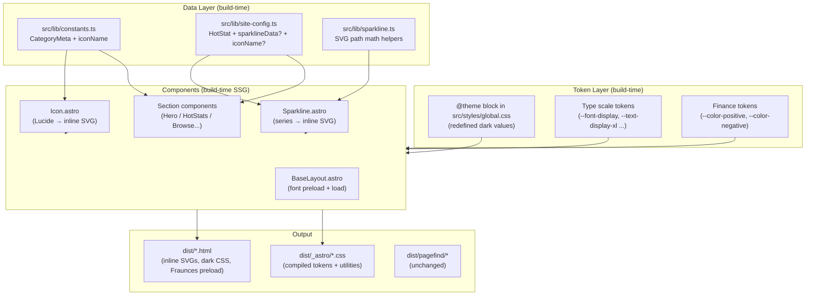
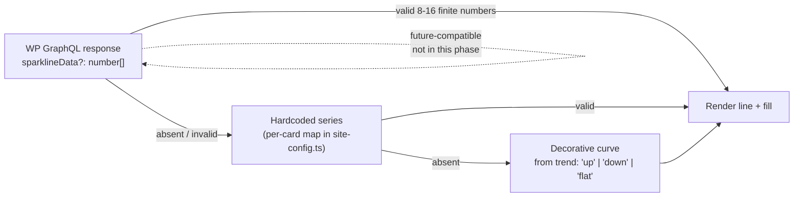
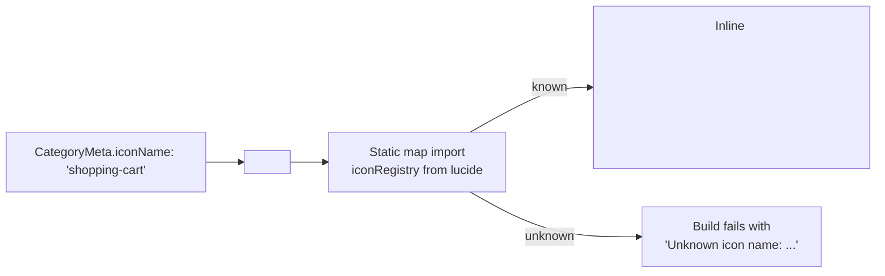
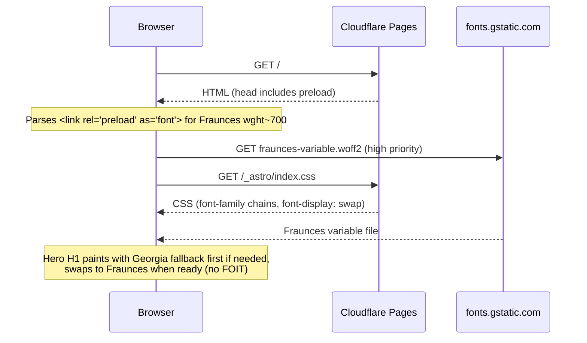

# Design Document — Visual System Uplift Phase 1

> Companion to [requirements.md](./requirements.md). High-Level Design + Low-Level Design in one document.
>
> Last updated: 2026-05-17

---

## Overview

Phase 1 of the visual uplift turns SaaSStatsHub's frontend from a "competent SaaS blog" into a "professional data terminal" by shipping four coordinated, dark-first changes to the existing Astro 6 + Tailwind 4 SSG site:

1. **Dark-first theme** as the only theme, achieved by redefining values inside the existing `@theme` token block in `src/styles/global.css` (no token name churn, no toggle UI).
2. **Sparkline mini-charts** on every Hero Stat card and on opt-in Article Stat cards, generated as inline SVG at SSG build time with no charting library and no client-side framework.
3. **Editorial display typography** — Fraunces variable serif for Hero / article H1 / section H2 headings — self-hosted via `@fontsource-variable/fraunces` and preloaded for the critical weight.
4. **Lucide icon system** as the single source of icons in primary UI, consumed via a hand-rolled tree-shaken `Icon.astro` wrapper that emits inline SVG at build time and fails the build for unknown icon names.

The design is constrained to: no new client-side JS framework, no WPGraphQL/ACF schema change, identical build pipeline (`astro build && pagefind --site dist`), identical Cloudflare Pages deploy, and a single contact email `sangaypopo@gmail.com`.

The rest of this document spells out the architecture, component-and-interface contracts, data models, error handling, correctness properties, and the verification matrix that ties every requirement to a concrete check.

## 1. Goals & Non-Goals (recap)

**In scope (4 work streams)**

- A.1 Dark-First Theme — token redefinition, all enumerated pages
- A.2 Sparklines — Hero_Stat_Card + Article_Stat_Card
- A.3 Display Typography — Fraunces (variable, opsz axis)
- A.4 Lucide Icon System — primary UI surfaces

**Out of scope**

- Light/dark theme toggle UI (architecture must not preclude it later)
- WPGraphQL/ACF schema changes
- Runtime JS frameworks (React/Vue/Preact/Solid/Svelte)
- IA / content / new homepage sections

---

## Architecture

This section consolidates the High-Level Design (sub-sections 2.1–2.8 below). It covers the build-time data flow, component map, token taxonomy, the cross-cutting decisions, and the risk register that drove those decisions.

### 2.1 Architecture overview



### 2.2 Sparkline data resolution chain



Note: WP path is wired today purely as a forward-compatibility branch. The phase ships only the hardcoded series + decorative-curve fallback — no schema change required.

### 2.3 Icon resolution



### 2.4 Font loading order (homepage)



### 2.5 Component map (created / modified / deleted)

| File | Action | Purpose |
|------|--------|---------|
| **Created** | | |
| `src/components/Icon.astro` | new | Lucide wrapper. Resolves `name` to inline SVG at SSG time, applies `aria-label` / `aria-hidden`, throws on unknown name. |
| `src/components/Sparkline.astro` | new | Inline SVG sparkline. Accepts `series` or `trend`, computes path + color + aria-label, respects reduced-motion via CSS. |
| `src/lib/sparkline.ts` | new | Pure helpers (validation, slope, path math, decorative curve, label formatter). No DOM, fully SSG-friendly. |
| `src/lib/icon-registry.ts` | new | Tree-shaken Lucide icon map: `Map<string, LucideIconNode>`. Imports only the ~16 icons we use. |
| `src/data/sparkline-defaults.ts` | new | Hardcoded series for default Hot Stat cards `s1–s8`. Used only when `sparklineData` is absent. |
| **Modified** | | |
| `src/styles/global.css` | edit | Redefine `@theme` token values for dark theme; add `--color-positive`, `--color-negative`, type-scale tokens, `--font-display`. Update legacy hardcoded backgrounds (`background: white`) to token references. |
| `src/lib/constants.ts` | edit | Add required `iconName: string` to `CategoryMeta`; populate the 8 mappings (per Req 4.1). |
| `src/lib/site-config.ts` | edit | Add optional `iconName?: string` and `sparklineData?: number[]` and `trend?: 'up' \| 'down' \| 'flat'` to `HotStat`. Default-config Hot Stat cards gain `iconName` + `trend` so they render via Lucide + correct sparkline color. |
| `src/layouts/BaseLayout.astro` | edit | Add Fraunces preload + Google Fonts load. Replace `cat.emoji` spans with `<Icon>` (3 places). Replace inline search/hamburger SVGs with `<Icon>`. Footer surface uses dark token instead of `bg-text`. |
| `src/layouts/ArticleLayout.astro` | edit | H1 gets `font-display`; drop-cap span (see decision §3.5). |
| `src/components/sections/HeroSection.astro` | edit | H1 uses `font-display` token. Hero category pills render `<Icon>` next to name. |
| `src/components/sections/HotStatsSection.astro` | edit | Each card slots `<Sparkline series={card.sparklineData ?? defaults[card.id]} trend={card.trend} />` between `.stat-label` and `.stat-source`. Card icon swaps to `<Icon>` when `iconName` is set. |
| `src/components/sections/BrowseCategoriesSection.astro` | edit | `cat-icon` slot renders `<Icon>` from `metaFor(cat).iconName`. Outer `bg-bg-alt` continues to work via token. |
| `src/components/sections/NewsletterCtaSection.astro` | edit | Card surface uses dark gradient. `bg-white` input → token-driven dark input. |
| `src/components/sections/LatestArticlesSection.astro` | edit | Eyebrow / heading colors via tokens. (Layout unchanged.) |
| `src/components/ArticleCard.astro` | edit | `background: white` → `var(--color-surface)`. Tag color stays primary. |
| `src/components/Breadcrumb.astro` | edit | Category step gains a small `<Icon>` (per Req 4.3). Colors via tokens. |
| `src/components/CookieConsent.astro` | edit | Background to dark-elevated token. Close button uses `<Icon name="x">`. |
| `src/components/Newsletter.astro` | edit | `.newsletter-box` background changed to dark gradient via tokens. |
| `src/components/SearchModal.astro` | edit | Modal shell to dark-elevated; close icon uses `<Icon name="x">`. |
| `src/components/StatCard.astro` | edit | Add optional `series?: number[]` and `trend?: 'up' \| 'down' \| 'flat'` props; render `<Sparkline>` when provided. |
| `src/components/QuickOverview.astro` | edit | Table chrome via tokens (already token-driven; minor). |
| `src/components/Sources.astro` | edit | External-link icon uses `<Icon name="external-link">`. |
| `src/components/CoverImage.astro` | edit | SVG palette adapts to dark surface (already gradient-driven; verify only). |
| Pages: `pages/{about,contact,write-for-us,404,privacy-policy,cookie-policy,terms-of-service,affiliate-disclosure}.astro` | edit | Card / panel chrome uses tokens; no copy changes. |
| `package.json` | edit | Add `lucide` (icon source), `@fontsource-variable/fraunces` (self-hosted variable font, see decision §3.2). |
| **Deleted** | | None. |

> The 8 default Hot Stat cards in `defaultSiteConfig` already use emoji as the `icon` field. We add `iconName` + `trend` next to it (backward-compatible). When the WP backend sends `iconName` for a card in a future phase, that value wins (Req 4.12).

### 2.6 Token taxonomy (proposed dark palette)

All tokens stay name-stable. Only values change. Contrast ratios are computed against `--color-bg = #0A0F1F` (the new body background).

| Token | Old (light) | New (dark) | Role | Contrast vs bg |
|------|------|------|------|------|
| `--color-bg` | `#FFFFFF` | `#0A0F1F` | Page background (L\* ≈ 9, in 8–14 range) | — |
| `--color-bg-alt` | `#F8FAFC` | `#0F172A` | Secondary surfaces (table headers, callouts) | — |
| `--color-bg-warm` | `#FAFBFF` | `#111827` | Warm panel background (newsletter, hero CTA card) | — |
| `--color-surface` *(new)* | — | `#0F1A2E` | Card / article-card / category-card surface | — |
| `--color-surface-elevated` *(new)* | — | `#162238` | Elevated surfaces (search modal, dropdown) | — |
| `--color-text` | `#0F172A` | `#F1F5F9` | Body text | **15.6:1** ✅ ≥ 7 |
| `--color-text-secondary` | `#475569` | `#CBD5E1` | Secondary text | **11.5:1** ✅ ≥ 4.5 |
| `--color-text-muted` | `#94A3B8` | `#94A3B8` | Metadata only | **6.0:1** ✅ ≥ 3 |
| `--color-border` | `#E2E8F0` | `#1E293B` | Default border | non-text 3:1 ✅ |
| `--color-border-light` | `#F1F5F9` | `#1A2236` | Subtle inner border | for hairlines |
| `--color-primary` | `#2563EB` | `#3B82F6` | Brand accent (slightly brighter for dark surfaces) | **5.5:1** ✅ ≥ 4.5 |
| `--color-primary-dark` | `#1E40AF` | `#1D4ED8` | Hover / pressed brand | — |
| `--color-primary-light` | `#DBEAFE` | `#1E3A8A` | Tag pills / chip background | — |
| `--color-primary-lighter` | `#EFF6FF` | `#172554` | Hover background tint | — |
| `--color-accent` | `#10B981` | `#34D399` | Tertiary accent | **8.4:1** ✅ |
| `--color-accent-light` | `#D1FAE5` | `#064E3B` | Soft accent tint | — |
| `--color-violet` | `#7C3AED` | `#A78BFA` | Tertiary accent (gradients) | **7.8:1** ✅ |
| `--color-violet-light` | `#EDE9FE` | `#3730A3` | Tint variant | — |
| `--color-warning` | `#F59E0B` | `#FBBF24` | Warning ticker | **9.7:1** ✅ |
| `--color-danger` | `#EF4444` | `#F87171` | Danger | **5.7:1** ✅ |
| `--color-positive` *(new)* | — | `#34D399` | Finance up (sparkline + delta) | **8.4:1** ✅ ≥ 4.5 |
| `--color-negative` *(new)* | — | `#F87171` | Finance down (sparkline + delta) | **5.7:1** ✅ ≥ 4.5 |
| `--color-neutral` *(new)* | — | `#94A3B8` | Flat sparkline | **6.0:1** ✅ |

> Contrast ratios above are computed using the WCAG 2.1 relative-luminance formula. They are sample values for design review; the build's CI step (Req 1.15) emits the **resolved** ratios from the production CSS for audit.

**Type scale tokens (new)**

```css
--font-display: 'Fraunces Variable', 'Fraunces', Georgia, 'Times New Roman', serif;
--font-body:    'Inter', system-ui, -apple-system, sans-serif;
--font-mono:    'JetBrains Mono', 'Fira Code', monospace;

--text-display-xl: clamp(36px, 4.5vw + 16px, 64px);   /* Hero H1; ≥56 desktop, ≥36 mobile */
--text-display-lg: clamp(28px, 2.8vw + 16px, 44px);   /* Article H1; ≥40 desktop, ≥28 mobile */
--text-heading-lg: clamp(22px, 1.4vw + 16px, 32px);   /* H2; ≥28 desktop, ≥22 mobile */
--text-heading-md: clamp(18px, 0.6vw + 16px, 22px);   /* H3; ≥20 desktop, ≥18 mobile */
--text-body:       17px;                              /* paragraph */
--text-small:      13px;                              /* metadata */
```

> The clamp() formulas guarantee the desktop floors at the upper viewport bound and the mobile floors at the lower bound, satisfying Req 3.6.

### 2.7 Decision log

| # | Decision | Chosen | Rejected | Why |
|---|----------|--------|----------|-----|
| §3.1 | Theme application | **Redefine values in `@theme` in place; wrap dark values in `:root` so a future `[data-theme="light"]` override is possible** | Add `[data-theme="dark"]` selector layer now | Phase is dark-only. In-place redefinition is the smallest diff and keeps every component CSS untouched. We still write the dark values under `:root` (not `[data-theme="dark"]`) so a future light theme overrides via `[data-theme="light"]` without re-flowing every component. Future-toggle-friendly without the toggle bloat. |
| §3.2 | Fraunces hosting | **Self-host via `@fontsource-variable/fraunces` in `node_modules`, copied to `/public/fonts/` at build time** | Google Fonts CDN | LCP control (we ship one .woff2 file with a stable URL on our origin, preloadable with high priority and cache-busted only on font version bump). Privacy (no fonts.googleapis.com round-trip). Tradeoff: ~75 KB asset on our origin instead of CF-cached Google Fonts; mitigated by preload of the single critical weight. Allowed by Req 5.12 (local `/public`). |
| §3.3 | Lucide integration | **`lucide` npm package, per-icon static `import { ShoppingCart, Users, ... } from 'lucide'` consumed by a hand-rolled `Icon.astro` that emits `<svg>` from the icon node at SSG time** | (a) `astro-icon` + `@iconify-json/lucide`; (b) raw inline SVG everywhere | (a) astro-icon pulls a JSON manifest at build time and works fine, but adds a build dependency and a few hundred KB to `node_modules` for a feature we use once. (b) inline SVG everywhere causes drift. The hand-rolled Icon.astro is ~30 lines of code, gives us perfect tree-shaking (only icons we `import` ship), guarantees inline SVG at SSG time (Req 4.6), and lets us throw on unknown name (Req 4.14). |
| §3.4 | Sparkline path generation | **Build-time. Astro frontmatter calls `pointsToPath(...)` and emits the resolved `<path d="...">` string** | Runtime generation in browser | Site is SSG. Build-time generation costs ~0ms per card and means zero JS shipped for sparklines (Req 2.18: ≤3 KB JS budget). Reduced-motion is honored via CSS only (no JS needed). |
| §3.5 | Drop-cap | **Wrap first letter in a `<span class="drop-cap">` server-side; apply Display_Font + larger size to the span** | Keep `::first-letter` pseudo-element | `::first-letter` works but doesn't support font-feature-settings reliably across browsers, and Fraunces's optical-size axis won't kick in on a pseudo-element in some engines. A wrapper span gives us deterministic styling and works across the board. We do the wrap in a small Astro helper that runs over the rendered HTML before injection. |
| §3.6 | Icon stroke-width | **1.75** | 1.5 (too thin on dark) or 2.0 (too heavy for our scale) | Centered in Req 4.9's 1.5–2.0 range; pairs well with Inter at 14–16px UI text. |
| §3.7 | Sparkline aria-label format | **`Trend: {direction} {percent}% over period`** with `period` left as the literal string (we don't know the time range) | Time-range-specific labels | Req 2.14 is satisfied. Generic "over period" avoids implying a time we don't have data for, while still describing the trend semantically. |

### 2.8 Risk register

| Risk | Likelihood | Impact | Mitigation |
|------|------------|--------|------------|
| Legacy hardcoded `background: white` / light gradients break in dark theme (`.gradient-border`, `.newsletter-box`, `.article-card`, `.category-card`, `.bg-text` footer assumption, `.glass`, table th `linear-gradient(--color-primary-light, ...)`) | **High** | High (visual regressions all over) | Per-component change list in §2.5 enumerates every site of `background: white` / hardcoded light values. CI step: grep `dist/_astro/*.css` for `:#FFFFFF\|: white\|#FFF\b` after build; any hit other than known-allowed locations (e.g. logo SVG fills) fails the build. |
| Fraunces variable file is ~75 KB; LCP regresses | Medium | Medium | (a) Preload only the single weight that backs the Hero H1 (Req 3.12). (b) Use `font-display: swap` so first paint uses Georgia fallback (Req 3.9). (c) Subset to Latin (Fontsource ships `latin` subset by default, ~75 KB → ~35 KB woff2). (d) LCP budget Req 3.11 (≤200 ms regression) gates merge. |
| Lucide bundle bloats if `import * as lucide` is used by mistake | Low | High (8 KB budget breach) | `Icon.astro` imports each icon explicitly from a hand-curated `icon-registry.ts` map. The map size is the bundle size — there's no path to import the full package. Build CI: parse `dist/_astro/*.js` for `lucide` references and assert ≤16 named imports. |
| Default Hot Stat config uses emoji `icon` field; if `iconName` is added but defaults aren't, those 8 cards render emoji instead of Lucide | Medium | Medium (inconsistent UI on first page) | Update `defaultSiteConfig.homepageSections[1].cards` in `site-config.ts` to add `iconName` for s1–s8 in the same commit that introduces `iconName` to the interface. Req 4.12 then renders Lucide. |
| Tailwind v4 `@theme` redefinition order surprises (some utilities cache the old value) | Low | Low | Tailwind v4's `@theme` is the source of truth for utility classes. We restart `astro dev` once after the change, and CI runs a fresh `npm install && npm run build` so caching can't bite. |
| Build-time `<svg>` injection from Lucide breaks if a future Lucide major version changes the node shape | Low | Medium | Pin `lucide` to a minor version (`^x.y.0`). Renderer reads only `tag`, `attrs`, and `children` keys — Lucide has kept this shape stable for years. If shape changes, the registry import will fail at compile time loudly. |
| Reduced-motion test coverage gap — dark-theme animations might still play under `prefers-reduced-motion` | Low | Medium | Existing CSS `@media (prefers-reduced-motion: reduce)` block already lists the common animations; we extend it to cover any new sparkline path animation. Verified manually with browser flag toggled. |
| Cookie banner / consent UI must still be readable when dark | Medium | Medium (legal-visibility issue) | CookieConsent.astro background → `--color-surface-elevated`; copy via `--color-text`; Accept/Decline buttons use `--color-primary` background. Verified against Req 1.7 enumerated set. |


---

## Components and Interfaces

This section is the Low-Level Design. It specifies the new components (`Icon.astro`, `Sparkline.astro`), the helper modules (`icon-registry.ts`, `sparkline.ts`, `dropcap.ts`), and the per-file change list that wires everything into the existing layouts and section components. Each interface is given as TypeScript / Astro pseudocode at a level of detail that lets an engineer drop the code in.

### 3.1 `src/lib/icon-registry.ts` (new)

```ts
/**
 * Hand-curated registry of Lucide icons used by this site.
 * Adding an icon here is a deliberate act — keeps tree-shaking honest.
 *
 * Lucide icons are tuples: [tag, attrs, children?]. We store the
 * imported reference so the build can resolve attrs at SSG time.
 */
import {
  Users,
  Megaphone,
  ShoppingCart,
  ClipboardList,
  UserCog,
  BarChart3,
  Shield,
  MessageSquare,
  // UI controls
  Search,
  Menu,
  X,
  ChevronDown,
  ChevronRight,
  ExternalLink,
  // Hot Stat icons (replace emoji set)
  TrendingUp,
  Building2,
  Rocket,
  Cloud,
  Smartphone,
  Lock,
  Bot,
  // Misc
  Mail,
} from 'lucide';
import type { IconNode } from 'lucide';

export const ICON_REGISTRY: Record<string, IconNode> = {
  // Categories (Req 4.1)
  users: Users,
  megaphone: Megaphone,
  'shopping-cart': ShoppingCart,
  'clipboard-list': ClipboardList,
  'user-cog': UserCog,
  'bar-chart-3': BarChart3,
  shield: Shield,
  'message-square': MessageSquare,

  // UI controls (Req 4.4)
  search: Search,
  menu: Menu,
  x: X,
  'chevron-down': ChevronDown,
  'chevron-right': ChevronRight,
  'external-link': ExternalLink,

  // Hot Stat replacements (Req 4.11)
  'trending-up': TrendingUp,
  'building-2': Building2,
  rocket: Rocket,
  cloud: Cloud,
  smartphone: Smartphone,
  lock: Lock,
  bot: Bot,

  // Misc
  mail: Mail,
};

export type RegisteredIconName = keyof typeof ICON_REGISTRY;

/**
 * Build-time resolution. Throws synchronously to fail the SSG build
 * with a clear error pointing at the offending field name (Req 4.14).
 */
export function resolveIcon(name: string): IconNode {
  const node = ICON_REGISTRY[name];
  if (!node) {
    throw new Error(
      `[icon-registry] Unknown icon name: "${name}". ` +
      `Either add it to ICON_REGISTRY or fix the source field. ` +
      `Known names: ${Object.keys(ICON_REGISTRY).join(', ')}`
    );
  }
  return node;
}
```

### 3.2 `src/components/Icon.astro` (new)

```astro
---
/**
 * Lucide icon → inline SVG at build time.
 *
 * Usage:
 *   <Icon name="search" aria-label="Search" />          // standalone control
 *   <Icon name="users" aria-hidden="true" />            // decorative next to text
 *   <Icon name="bar-chart-3" size={28} class="text-primary" />
 *
 * Behavior:
 * - `name` resolves through ICON_REGISTRY; unknown names FAIL THE BUILD (Req 4.13/14).
 * - When `aria-label` is set: keeps role=img (interactive icon-only control case).
 * - When `aria-hidden="true"`: drops role attribute (Req 4.8).
 * - Defaults: 18px size, 1.75 stroke-width (Req 4.9).
 * - Inherits `currentColor` so the wrapping element controls color via Tailwind / tokens.
 */
import { resolveIcon } from '../lib/icon-registry';

interface Props {
  name: string;
  size?: number;
  class?: string;
  'aria-label'?: string;
  'aria-hidden'?: 'true' | 'false';
  strokeWidth?: number;
}

const {
  name,
  size = 18,
  class: className,
  'aria-label': ariaLabel,
  'aria-hidden': ariaHidden,
  strokeWidth = 1.75,
} = Astro.props;

const node = resolveIcon(name);
const [tag, attrs, children = []] = node;

const isHidden = ariaHidden === 'true';
const a11y = isHidden
  ? { 'aria-hidden': 'true' as const }
  : { role: 'img', 'aria-label': ariaLabel ?? name };
---

<svg
  xmlns="http://www.w3.org/2000/svg"
  width={size}
  height={size}
  viewBox="0 0 24 24"
  fill="none"
  stroke="currentColor"
  stroke-width={strokeWidth}
  stroke-linecap="round"
  stroke-linejoin="round"
  class={className}
  {...a11y}
>
  {/* Lucide IconNode children: array of [tagName, attrs] tuples */}
  {(children as Array<[string, Record<string, string>]>).map(([childTag, childAttrs]) => {
    if (childTag === 'circle') return <circle {...childAttrs} />;
    if (childTag === 'rect')   return <rect   {...childAttrs} />;
    if (childTag === 'line')   return <line   {...childAttrs} />;
    if (childTag === 'path')   return <path   {...childAttrs} />;
    if (childTag === 'polyline') return <polyline {...childAttrs} />;
    if (childTag === 'polygon')  return <polygon  {...childAttrs} />;
    if (childTag === 'ellipse')  return <ellipse  {...childAttrs} />;
    return null;
  })}
</svg>
```

> Note: Lucide's `IconNode` shape has been stable for years (`[tag, attrs, children]`). We only render the 7 SVG primitives Lucide actually uses, so an unknown child tag silently drops and visibly breaks during dev — easy to spot.

### 3.3 `src/lib/sparkline.ts` (new)

```ts
/**
 * Pure sparkline math helpers. SSG-friendly — no DOM, no window.
 * All functions are deterministic.
 */

const POSITIVE_THRESHOLD = 0.01;  // Req 2.7: ±0.01 normalized slope

export type TrendDirection = 'up' | 'down' | 'flat';
export type TrendClass = 'positive' | 'negative' | 'neutral';

/**
 * Validate per Req 2.3: 8–16 finite numbers.
 * Returns the input array on success or null on failure.
 */
export function validateSeries(input: unknown): number[] | null {
  if (!Array.isArray(input)) return null;
  if (input.length < 8 || input.length > 16) return null;
  for (const v of input) {
    if (typeof v !== 'number' || !Number.isFinite(v)) return null;
  }
  return input as number[];
}

/**
 * Normalized linear-regression slope.
 * Each value is divided by the series mean, then a least-squares slope
 * is computed against indices [0..n-1]. Result is dimensionless and
 * comparable to the ±0.01 threshold regardless of absolute magnitude.
 */
export function computeSlope(values: number[]): number {
  const n = values.length;
  const mean = values.reduce((a, b) => a + b, 0) / n;
  if (mean === 0) return 0;  // edge case: classify as neutral

  const ys = values.map((v) => v / mean);
  const xMean = (n - 1) / 2;
  const yMean = ys.reduce((a, b) => a + b, 0) / n;

  let num = 0;
  let den = 0;
  for (let i = 0; i < n; i++) {
    num += (i - xMean) * (ys[i] - yMean);
    den += (i - xMean) ** 2;
  }
  return den === 0 ? 0 : num / den;
}

export function classifyTrend(slope: number): TrendClass {
  if (slope > POSITIVE_THRESHOLD) return 'positive';
  if (slope < -POSITIVE_THRESHOLD) return 'negative';
  return 'neutral';
}

/**
 * Convert a 1-D series to two SVG path strings: line and gradient-fill.
 * The fill always closes to the bottom of the box so it renders as a
 * filled "area chart" beneath the line.
 *
 * Coordinate space:
 *   x: 0 (first) → w (last), evenly spaced
 *   y: 0 (max value) → h (min value), padded 2px top/bottom
 */
export function pointsToPath(
  values: number[],
  w: number,
  h: number
): { line: string; fill: string; lastX: number; lastY: number } {
  const padY = 2;
  const innerH = h - padY * 2;
  const min = Math.min(...values);
  const max = Math.max(...values);
  const range = max - min || 1;

  const points = values.map((v, i) => {
    const x = (i / (values.length - 1)) * w;
    const y = padY + (1 - (v - min) / range) * innerH;
    return [x, y] as const;
  });

  const linePath = points
    .map(([x, y], i) => (i === 0 ? `M ${x.toFixed(2)} ${y.toFixed(2)}` : `L ${x.toFixed(2)} ${y.toFixed(2)}`))
    .join(' ');

  const fillPath =
    `M 0 ${h} ` +
    points.map(([x, y]) => `L ${x.toFixed(2)} ${y.toFixed(2)}`).join(' ') +
    ` L ${w} ${h} Z`;

  const [lastX, lastY] = points[points.length - 1];
  return { line: linePath, fill: fillPath, lastX, lastY };
}

/**
 * Decorative curve for cards without a real series.
 * Returns a smooth-ish 12-point series whose slope satisfies the
 * trend direction. Deterministic — no randomness.
 */
export function decorativeCurve(trend: TrendDirection, length = 12): number[] {
  const out: number[] = [];
  for (let i = 0; i < length; i++) {
    const t = i / (length - 1);                      // 0 → 1
    const wobble = Math.sin(i * 1.3) * 0.06;          // small organic bumps
    let value: number;
    if (trend === 'up')        value = 0.4 + 0.6 * t + wobble;
    else if (trend === 'down') value = 1.0 - 0.6 * t + wobble;
    else                        value = 0.7 + wobble * 1.2;  // flat with subtle ripple
    out.push(Number(value.toFixed(4)));
  }
  return out;
}

/**
 * Compose the aria-label per Req 2.14.
 * - With a series: "Trend: up 14.2% over period"
 * - From decorative trend only: "Trend: up"
 */
export function formatAriaLabel(
  direction: TrendDirection,
  percentChange: number | null
): string {
  if (percentChange === null) return `Trend: ${direction}`;
  return `Trend: ${direction} ${Math.abs(percentChange).toFixed(1)}% over period`;
}

export function percentChange(values: number[]): number {
  const first = values[0];
  const last = values[values.length - 1];
  if (first === 0) return 0;
  return ((last - first) / first) * 100;
}

export function trendClassToDirection(c: TrendClass): TrendDirection {
  if (c === 'positive') return 'up';
  if (c === 'negative') return 'down';
  return 'flat';
}
```

### 3.4 `src/components/Sparkline.astro` (new)

```astro
---
/**
 * Inline-SVG sparkline. Build-time generation, no client JS required.
 *
 * Usage on a Hero_Stat_Card:
 *   <Sparkline series={card.sparklineData ?? defaults[card.id]} trend={card.trend} />
 *
 * Usage on an Article_Stat_Card:
 *   <Sparkline trend="up" />          {/* decorative curve only */}
 *   <Sparkline series={[10,12,11,...]} />
 *
 * Reduced-motion: handled via CSS `@media (prefers-reduced-motion: reduce)`
 * suppressing the `line-draw` animation. No JS hook needed.
 */
import {
  validateSeries,
  computeSlope,
  classifyTrend,
  trendClassToDirection,
  pointsToPath,
  decorativeCurve,
  formatAriaLabel,
  percentChange,
  type TrendDirection,
} from '../lib/sparkline';

interface Props {
  series?: number[];
  trend?: TrendDirection;
  ariaLabel?: string;
  width?: number;
  height?: number;
  animate?: boolean;
}

const {
  series,
  trend = 'flat',
  ariaLabel,
  width = 140,    // default; CSS makes it scale with the card
  height = 32,
  animate = true,
} = Astro.props;

// Resolve data per Req 2.4 fallback chain
const validated = validateSeries(series);
const isDecorative = !validated;
const values = validated ?? decorativeCurve(trend);

// Compute color class
const slope = computeSlope(values);
const cls = classifyTrend(slope);
const direction: TrendDirection = isDecorative ? trend : trendClassToDirection(cls);

// Path math
const { line, fill, lastX, lastY } = pointsToPath(values, width, height);

// aria-label per Req 2.14
const labelText = ariaLabel ?? formatAriaLabel(
  direction,
  isDecorative ? null : percentChange(values)
);

// Color → CSS variable
const colorVar = cls === 'positive' ? 'var(--color-positive)'
  : cls === 'negative' ? 'var(--color-negative)'
  : 'var(--color-neutral)';

// Stable gradient ID per render (avoid collisions when many sparklines on one page)
const gradientId = `spark-grad-${Math.random().toString(36).slice(2, 9)}`;
---

<svg
  class:list={['sparkline', { 'sparkline--animate': animate }]}
  viewBox={`0 0 ${width} ${height}`}
  preserveAspectRatio="none"
  width="100%"
  height={height}
  role="img"
  aria-label={labelText}
  style={`color: ${colorVar}; --spark-w: ${width}; --spark-h: ${height};`}
>
  <defs>
    <linearGradient id={gradientId} x1="0" y1="0" x2="0" y2="1">
      <stop offset="0%"   stop-color="currentColor" stop-opacity="0.20" />
      <stop offset="100%" stop-color="currentColor" stop-opacity="0.00" />
    </linearGradient>
  </defs>
  <path d={fill} fill={`url(#${gradientId})`} />
  <path
    class="sparkline__line"
    d={line}
    fill="none"
    stroke="currentColor"
    stroke-width="1.5"
    stroke-linecap="round"
    stroke-linejoin="round"
  />
  <circle cx={lastX} cy={lastY} r="2.5" fill="currentColor" />
</svg>

<style>
  .sparkline { display: block; min-width: 100px; min-height: 28px; }
  .sparkline__line {
    /* Draw-in animation per Req 2.16. */
    stroke-dasharray: 600;
    stroke-dashoffset: 600;
  }
  .sparkline--animate .sparkline__line {
    animation: sparkline-draw 800ms cubic-bezier(0.16, 1, 0.3, 1) forwards;
  }
  @keyframes sparkline-draw {
    to { stroke-dashoffset: 0; }
  }
  /* Static fallback: still want the line visible if animation is suppressed */
  @media (prefers-reduced-motion: reduce) {
    .sparkline__line {
      stroke-dasharray: none;
      stroke-dashoffset: 0;
      animation: none !important;
    }
  }
</style>
```

### 3.5 `src/data/sparkline-defaults.ts` (new) — hardcoded series for default Hot Stats

```ts
/**
 * Hardcoded sparkline series for the 8 default Hero_Stat_Card cards.
 * Used only when WP `sparklineData` is absent.
 *
 * Series semantics:
 *  - 12 points each (in 8–16 valid range; mid-density looks best at 140×32)
 *  - Trends are CHOSEN to match the card's narrative (e.g. SaaS market is rising)
 *  - Magnitudes are dimensionless; only the slope's sign matters for color.
 */
export const SPARKLINE_DEFAULTS: Record<string, number[]> = {
  // s1 — Global SaaS Market $232B, up
  s1: [180, 184, 191, 198, 203, 209, 214, 219, 223, 226, 229, 232],
  // s2 — CAGR 14.2%, mostly up with mild volatility
  s2: [11.0, 11.8, 12.1, 12.6, 12.9, 13.4, 13.7, 13.5, 13.9, 14.0, 14.1, 14.2],
  // s3 — 30,000+ companies worldwide, steady up
  s3: [22000, 23200, 24100, 25000, 25800, 26600, 27400, 28100, 28700, 29200, 29600, 30000],
  // s4 — Enterprise adoption 78%, accelerating
  s4: [62, 64, 66, 68, 70, 72, 73, 74, 75, 76, 77, 78],
  // s5 — Cloud adoption 94%, near-saturation flat-up
  s5: [88, 89, 90, 90.5, 91, 91.6, 92, 92.5, 93, 93.4, 93.7, 94],
  // s6 — Mobile SaaS usage 68%, steady up
  s6: [54, 56, 58, 59, 60, 62, 63, 64, 65, 66, 67, 68],
  // s7 — Cybersecurity spend $188B, up
  s7: [150, 154, 158, 162, 166, 170, 173, 176, 179, 182, 185, 188],
  // s8 — AI-powered SaaS tools 12,400, up
  s8: [7800, 8200, 8800, 9300, 9900, 10400, 10900, 11300, 11700, 12000, 12200, 12400],
};
```

### 3.6 `src/lib/constants.ts` change (per-category iconName)

Diff (logical):

```ts
export interface CategoryMeta {
  slug: string;
  name: string;
  shortName?: string;
  emoji: string;          // RETAINED, decorative-only (Req 4.2)
  iconName: string;       // NEW (Req 4.1)
  color: string;
  colorEnd: string;
  bg: string;
  desc: string;
}

export const CATEGORIES: CategoryMeta[] = [
  { slug: 'crm',                name: 'CRM',                shortName: 'CRM',         emoji: '👥', iconName: 'users',           color: '#3B82F6', colorEnd: '#A78BFA', bg: '#1E3A8A', desc: 'Customer relationship management stats' },
  { slug: 'marketing',          name: 'Marketing',          shortName: 'Marketing',   emoji: '📣', iconName: 'megaphone',       color: '#A78BFA', colorEnd: '#F472B6', bg: '#3730A3', desc: 'Digital marketing platform data' },
  { slug: 'ecommerce',          name: 'E-commerce',         shortName: 'E-commerce',  emoji: '🛒', iconName: 'shopping-cart',   color: '#34D399', colorEnd: '#10B981', bg: '#064E3B', desc: 'Online retail & marketplace insights' },
  { slug: 'project-management', name: 'Project Management', shortName: 'Project Mgmt', emoji: '📋', iconName: 'clipboard-list', color: '#FBBF24', colorEnd: '#F59E0B', bg: '#78350F', desc: 'PM tool adoption & productivity' },
  { slug: 'hr',                 name: 'HR & Payroll',       shortName: 'HR',          emoji: '🧑‍💼', iconName: 'user-cog',        color: '#F87171', colorEnd: '#EF4444', bg: '#7F1D1D', desc: 'Human resources & workforce data' },
  { slug: 'analytics',          name: 'Analytics',          shortName: 'Analytics',   emoji: '📊', iconName: 'bar-chart-3',     color: '#22D3EE', colorEnd: '#06B6D4', bg: '#164E63', desc: 'Business intelligence & data tools' },
  { slug: 'security',           name: 'Security',           shortName: 'Security',    emoji: '🔒', iconName: 'shield',          color: '#818CF8', colorEnd: '#6366F1', bg: '#312E81', desc: 'Cybersecurity & compliance' },
  { slug: 'communication',      name: 'Communication',      shortName: 'Comms',       emoji: '💬', iconName: 'message-square',  color: '#2DD4BF', colorEnd: '#14B8A6', bg: '#134E4A', desc: 'Messaging & collaboration platforms' },
];
```

> Note: brightened the `color` and shifted `bg` to dark-tinted backgrounds so category cards work on the dark surface. `emoji` field retained per Req 4.2.

### 3.7 `src/lib/site-config.ts` change (HotStat extension)

```ts
export interface HotStat {
  id: string;
  icon: string;                  // RETAINED for backward compat (Req 4.11)
  iconName?: string;             // NEW; preferred over `icon` when set (Req 4.12)
  number: string;
  label: string;
  source: string;
  gradient?: string;
  enabled: boolean;
  trend?: 'up' | 'down' | 'flat';   // NEW; drives sparkline color when no series (Req 2.4)
  sparklineData?: number[];      // NEW; future-compatible WP path (Req 2.10/2.11)
}
```

`defaultSiteConfig.homepageSections[1].cards` updates each card with `iconName` + `trend`:

```ts
{ id: 's1', icon: '📊', iconName: 'trending-up', trend: 'up', number: '$232B',   ...},
{ id: 's2', icon: '📈', iconName: 'bar-chart-3', trend: 'up', number: '14.2%',   ...},
{ id: 's3', icon: '🏢', iconName: 'building-2',  trend: 'up', number: '30,000+', ...},
{ id: 's4', icon: '🚀', iconName: 'rocket',      trend: 'up', number: '78%',     ...},
{ id: 's5', icon: '☁️', iconName: 'cloud',        trend: 'up', number: '94%',     ...},
{ id: 's6', icon: '📱', iconName: 'smartphone',  trend: 'up', number: '68%',     ...},
{ id: 's7', icon: '🔐', iconName: 'lock',         trend: 'up', number: '$188B',   ...},
{ id: 's8', icon: '🤖', iconName: 'bot',          trend: 'up', number: '12,400',  ...},
```

### 3.8 Per-component change list (selectors → new behavior)

Compact diff list. Each row tells the implementer the exact site of change.

| File | Element / Selector | Change |
|------|--------------------|--------|
| `BaseLayout.astro` (head) | new `<link rel="preload">` + `<link rel="stylesheet">` | Preload Fraunces critical weight from `/fonts/fraunces-...woff2`; load full stylesheet via `<style>` `@font-face` declaration with `font-display: swap`. Drop existing Google Fonts `<link>` tags (Inter / JetBrains Mono stay; we keep them or self-host too — see implementation note below). |
| `BaseLayout.astro` (header desktop dropdown) | `<span class="w-7 h-7 inline-flex ...">{cat.emoji}</span>` | Replace with `<Icon name={cat.iconName} aria-hidden="true" class="w-4 h-4 text-text-secondary" />` |
| `BaseLayout.astro` (header search button) | inline `<svg ...search...>` | Replace with `<Icon name="search" aria-label="Search" />` |
| `BaseLayout.astro` (mobile hamburger) | inline `<svg ...M4 6h16...>` | Replace with `<Icon name="menu" aria-label="Open menu" />` |
| `BaseLayout.astro` (header chevron) | inline `<svg ...M19 9l-7 7...>` | Replace with `<Icon name="chevron-down" aria-hidden="true" class="w-3.5 h-3.5 ..." />` |
| `BaseLayout.astro` (mobile menu category list) | `<span>{cat.emoji}</span>` | Replace with `<Icon name={cat.iconName} aria-hidden="true" class="w-4 h-4" />` |
| `BaseLayout.astro` (footer) | `<footer class="bg-text text-white">` | Change to `<footer class="bg-surface text-text border-t border-border">` (token-driven, dark-aware) |
| `HeroSection.astro` (H1) | `<h1 class="text-white text-4xl md:text-6xl lg:text-7xl font-extrabold ...">` | Add `font-display` Tailwind class (or wrap with `style="font-family: var(--font-display);"`); remove `text-white` (now inherits from `--color-text` which is light on dark). Letter-spacing + line-height come from token-applied utility class. |
| `HeroSection.astro` (category pill loop) | `<span>{meta.emoji}</span>` | Replace with `<Icon name={meta.iconName} aria-hidden="true" class="w-3.5 h-3.5" />` |
| `HotStatsSection.astro` (card body) | between `.stat-label` and `.stat-source` | Insert: `<Sparkline series={stat.sparklineData ?? SPARKLINE_DEFAULTS[stat.id]} trend={stat.trend} animate={!isReducedMotion} />`. Wrap in `<div class="mt-3">`. |
| `HotStatsSection.astro` (`.stat-icon-emoji` block) | `<div class="stat-icon-emoji">{stat.icon}</div>` | Render Icon when `iconName` set (Req 4.12): `{stat.iconName ? <Icon name={stat.iconName} class="w-5 h-5 text-cyan-300" /> : <div class="stat-icon-emoji">{stat.icon}</div>}` |
| `BrowseCategoriesSection.astro` (`.cat-icon`) | `<span>{meta.emoji}</span>` | Replace with `<Icon name={meta.iconName} aria-hidden="true" class="w-6 h-6" />`; outer `.cat-icon` keeps tinted background |
| `NewsletterCtaSection.astro` (card shell) | `bg-bg-warm` | OK as-is (token now resolves dark-warm) |
| `NewsletterCtaSection.astro` (input) | `bg-white border border-border` | Change to `bg-surface-elevated border border-border` |
| `NewsletterCtaSection.astro` (decorative bar svg) | hardcoded `fill="#2563EB" #7C3AED #10B981 #F59E0B` | Keep — these are in a 0.04 opacity decoration; verify legibility vs new bg, but no token swap needed |
| `LatestArticlesSection.astro` (eyebrow) | `text-primary` | OK (token now bright blue on dark) |
| `ArticleCard.astro` `.article-card` | `background: white` | (in global.css) → `background: var(--color-surface)` |
| `ArticleCard.astro` (card-tag) | `bg-primary-light text-primary-dark` | OK (tokens redefined; chip stays distinguishable) |
| `Breadcrumb.astro` (category step) | text-only crumb | Add `<Icon name={metaFor(...).iconName} aria-hidden="true" class="w-3 h-3 mr-1 inline" />` before label |
| `Breadcrumb.astro` (separator) | `<span>` | Replace with `<Icon name="chevron-right" aria-hidden="true" class="w-3 h-3 ..." />` |
| `CookieConsent.astro` (banner shell) | (light gradient) | Background → `var(--color-surface-elevated)`; text → `var(--color-text)`; close button → `<Icon name="x" aria-label="Dismiss" />` |
| `Newsletter.astro` (`.newsletter-box`) | `border: 2px solid --color-primary; background: linear-gradient(135deg, --color-primary-lighter, #F0F0FF)` | Background → `linear-gradient(135deg, var(--color-surface), var(--color-surface-elevated))`; border opacity reduced; text color tokens. Mail emoji 📬 → `<Icon name="mail">` |
| `SearchModal.astro` (modal shell) | (existing dark-themed already) | Verify; close button uses `<Icon name="x">`; result row hover → `bg-surface-elevated` |
| `StatCard.astro` | (props) | Add `series?: number[]` and `trend?: TrendDirection`; render `<Sparkline>` when either is provided (Req 2.12). |
| `Sources.astro` (each source link) | trailing arrow | Add `<Icon name="external-link" class="w-3 h-3 ml-1 inline" aria-hidden="true" />` |
| `QuickOverview.astro` (table th) | `linear-gradient(135deg, --color-primary-light, #E0E7FF)` | Hardcoded `#E0E7FF` → use `--color-primary-lighter` (tokens redefined to dark) |
| `global.css` (`.gradient-border`) | `background: white` | → `background: var(--color-surface)` |
| `global.css` (`.glass`) | `rgba(255,255,255,0.7)` | Header is sticky; switch to `glass-dark` style (`rgba(15,23,42,0.55)` blur 12px) — replace the class application or redefine `.glass` to dark variant. Single `.glass` is fine since we're dark-only. |
| `global.css` (`.bg-dot-grid`) | hardcoded `#CBD5E1` | OK to leave (decorative); or swap to `rgba(148,163,184,0.20)` for visibility |
| `global.css` (`.article-content blockquote`) | `background: --color-bg-alt` | OK (token resolves dark) |
| `global.css` (article-body `code` background) | `--color-bg-alt` | OK |
| `global.css` (newsletter button hover) | hardcoded `linear-gradient(135deg, #1E3A8A, #1D4ED8)` | OK |
| `global.css` (selection) | `rgba(37,99,235,0.15)` | OK; bump to `rgba(59,130,246,0.30)` for visibility on dark |
| `global.css` (scrollbar thumb) | `--color-border` | OK (now dark) |

### 3.9 BaseLayout font loading snippet

```html
<!-- in BaseLayout.astro <head> -->

<!-- Preload the single critical Fraunces weight (Hero H1 uses ~700) -->
<link
  rel="preload"
  href="/fonts/fraunces-variable-latin.woff2"
  as="font"
  type="font/woff2"
  crossorigin
/>

<!-- Inline @font-face so we avoid a render-blocking stylesheet round-trip -->
<style>
  @font-face {
    font-family: 'Fraunces Variable';
    src: url('/fonts/fraunces-variable-latin.woff2') format('woff2-variations');
    font-weight: 100 900;
    font-style: normal;
    font-display: swap;
  }
</style>
```

> The font file is copied from `node_modules/@fontsource-variable/fraunces/files/fraunces-latin-wght-normal.woff2` to `public/fonts/` by a one-line `prebuild` script in package.json (`"prebuild": "cp node_modules/@fontsource-variable/fraunces/files/fraunces-latin-wght-normal.woff2 public/fonts/fraunces-variable-latin.woff2"`).

### 3.10 Build-time icon-resolution failure mechanism

The flow:

1. Component renders `<Icon name="foo" />`
2. Inside `Icon.astro`, `resolveIcon('foo')` is called in the frontmatter (top-level `---` block)
3. `resolveIcon` looks up `ICON_REGISTRY['foo']`; not found → `throw new Error('[icon-registry] Unknown icon name: "foo". ...')`
4. Astro's SSG runner catches the throw inside the component module, fails the render, and surfaces the error in `npm run build` with the file + line of the offending `<Icon>` usage.
5. Result: `npm run build` exits non-zero. Cloudflare Pages deployment fails. (Req 4.13/4.14)

### 3.11 Drop-cap implementation

Astro frontmatter helper that wraps the first character of the first paragraph:

```ts
// src/lib/dropcap.ts
export function withDropCap(html: string): string {
  // Match first <p>...</p> and wrap its first non-whitespace character
  return html.replace(
    /<p>(\s*)([\p{L}\p{N}])/u,
    (_, ws, char) => `<p>${ws}<span class="drop-cap">${char}</span>`
  );
}
```

CSS:

```css
.drop-cap {
  font-family: var(--font-display);
  font-feature-settings: 'opsz' 144;        /* large optical size */
  float: left;
  font-size: 3.4em;
  line-height: 0.85;
  padding: 0.06em 0.10em 0 0;
  color: var(--color-primary);
  font-weight: 700;
}
```

`ArticleLayout.astro` calls `withDropCap(content)` once before injecting article HTML.

---

## Data Models

The Phase introduces no new persistent data models — the WPGraphQL / ACF schema stays unchanged. It does extend three TypeScript interfaces in the frontend:

**`CategoryMeta`** (`src/lib/constants.ts`) — adds one **required** field:

```ts
interface CategoryMeta {
  // existing fields preserved unchanged: slug, name, shortName?, emoji, color, colorEnd, bg, desc
  iconName: string;       // NEW (Req 4.1) — kebab-case Lucide icon name; required for every category
}
```

The 8 default category mappings are listed in §3.6.

**`HotStat`** (`src/lib/site-config.ts`) — adds three **optional** fields:

```ts
interface HotStat {
  // existing fields preserved: id, icon, number, label, source, gradient?, enabled
  iconName?: string;                       // NEW (Req 4.11) — preferred over `icon` when set
  trend?: 'up' | 'down' | 'flat';          // NEW (Req 2.4) — drives sparkline color when no series
  sparklineData?: number[];                // NEW (Req 2.10/2.11) — 8–16 finite numbers; future-WP path
}
```

**StatCard component props** (`src/components/StatCard.astro`):

```ts
interface Props {
  // existing: number, label, source?, variant?
  series?: number[];                       // NEW (Req 2.12) — opt-in sparkline data
  trend?: 'up' | 'down' | 'flat';          // NEW — opt-in decorative trend
}
```

A new helper module also exports the validated runtime types used by sparkline math:

```ts
// src/lib/sparkline.ts
type TrendDirection = 'up' | 'down' | 'flat';
type TrendClass = 'positive' | 'negative' | 'neutral';
```

All other existing types (`SiteConfig`, `HomeSection`, `ArticleCard`, `Category`, `ArticleDetail`, `QuickOverviewItem`, `KeyTakeaway`, `SourceItem`, `HomePageData`, `CategoryPageData`) remain byte-identical.

A new asset module ships a hardcoded series-per-card map for the 8 default Hot Stats (full table in §3.5):

```ts
// src/data/sparkline-defaults.ts
export const SPARKLINE_DEFAULTS: Record<string, number[]>;
```

## Correctness Properties

Properties the system must hold after Phase 1 ships. Each is paired with a concrete enforcement mechanism (a build-time check, a unit test, or a runtime CSS rule) so it can be verified mechanically.

### Property 1: Dark-Theme Coverage

**Validates: Requirements 1.1, 1.2, 1.7**

Every page enumerated in Req 1.7 renders with a Dark_Theme background. **Enforced by:** a headless smoke test that opens each URL and asserts the computed `background-color` of `<body>` resolves to a value in CIE Lab L\* 8–14.

### Property 2: Contrast Ratios Met

**Validates: Requirements 1.3, 1.4, 1.5, 1.6, 1.13, 1.14, 1.15**

Body / secondary / muted text contrast ratios meet 7.0:1 / 4.5:1 / 3.0:1 against the page background. **Enforced by:** axe-core / pa11y over the home, article, and footer; the resolved hex pairs are also asserted in the Phase 1 changelog (Req 1.15).

### Property 3: Existing Animations Preserved

**Validates: Requirements 1.8, 3.14**

Existing animations (typewriter, count-up, scanline, spotlight, float, border-flow, reading-progress) still render and still trigger from the same DOM hooks. **Enforced by:** a visual smoke test that loads the homepage, observes each animation, and snapshot-asserts the named DOM hooks (`[data-typewriter]`, `.type-caret`, `#hero-tagline`, `#reading-progress`, `.hero-stat-card`, `.tech-border`) are present.

### Property 4: Sparkline Data Resolution Chain Honored

**Validates: Requirements 2.4, 2.5, 2.10, 2.11**

The chain WP `sparklineData` → hardcoded series → decorative curve from `trend` always resolves to a valid render input. **Enforced by:** unit tests on `validateSeries` and the resolution helper that exercise every branch.

### Property 5: Sparkline Color Matches Slope

**Validates: Requirements 2.6, 2.7**

Sparkline color matches the slope sign at the ±0.01 normalized threshold. **Enforced by:** unit tests on `computeSlope` + `classifyTrend` with fixtures at slope 0.05, -0.05, 0.005, -0.005, and 0.

### Property 6: Icons Are Inline SVG, Never Runtime

**Validates: Requirements 4.5, 4.6, 4.13**

Every Lucide icon ships as inline `<svg>` in built HTML — never as an icon font, sprite, CDN, or runtime fetch. **Enforced by:** grep `dist/*.html` for `<i class="icon-`, `data-icon=`, `class="lucide-"` (font shape), and any external icon CDN URL — all expected zero.

### Property 7: Unknown Icon Names Fail the Build

**Validates: Requirements 4.13, 4.14**

Building with an `iconName` value that is not registered fails the build with a named error. **Enforced by:** a negative test in CI that temporarily sets one `iconName` to `"definitely-not-a-lucide-icon"` and expects non-zero exit plus the registered error text.

### Property 8: Build Pipeline Healthy

**Validates: Requirements 1.10, 5.1, 5.2, 5.3**

`npm run build` exits 0 within 600 s wall-clock; the Pagefind page count is at least the baseline. **Enforced by:** the build job timeout and the Pagefind index assertion in CI.

### Property 9: Lighthouse Within Budget

**Validates: Requirements 3.11, 5.11**

Performance regression ≤ 5 points (per page, per profile); Accessibility ≥ baseline; LCP regression ≤ 200 ms. **Enforced by:** Lighthouse CI comparing same-page-same-profile metrics against the Pre_Phase_Baseline.

### Property 10: No New Client-Side Framework

**Validates: Requirements 4.15, 5.7**

No new client-side JS framework (React, Vue, Preact, Solid, Svelte) appears in `package.json` or in built JS. **Enforced by:** a static check on `package.json` and a grep over `dist/_astro/*.js`.

### Property 11: Token Names Stable

**Validates: Requirements 1.12**

Every existing TypeScript token name in `@theme` survives unchanged (only values change). **Enforced by:** a `git diff` of token NAMES (regex match on `--color-*`, `--font-*`, `--space-*`, `--radius-*`, `--shadow-*`, `--ease-*`, `--duration-*`); zero deletions expected.

### Property 12: Single Contact Email

**Validates: Requirements 5.10**

The single contact email visible to users is `sangaypopo@gmail.com`. **Enforced by:** grep `dist/**/*.html` for `@`-literal email patterns; the allowlist is just `sangaypopo@gmail.com` and `cms.saasstatshub.com`.

### Property 13: Reduced-Motion Respected

**Validates: Requirements 1.9, 2.15, 2.16**

Reduced-motion users see no sparkline draw-in animation and no scanline / ticker-blink / grid-pan / border-flow. **Enforced by:** CSS rules under `@media (prefers-reduced-motion: reduce)`, plus a visual check with the browser flag toggled.

## Error Handling

The phase is build-time-heavy, so most error handling is "fail the build loudly" rather than "graceful runtime fallback".

| Error path | Behavior | Rationale |
|------------|----------|-----------|
| `iconName` does not resolve in `ICON_REGISTRY` | Build throws `[icon-registry] Unknown icon name: "<name>". ...` and `npm run build` exits non-zero. The Cloudflare Pages deploy fails. | A typo in an icon name is a content bug we want caught before users see it (Req 4.13/4.14). The error message includes the offending name and the list of registered names so the fix is one line. |
| Sparkline `series` provided but invalid (length out of 8–16, contains non-finite values) | `Sparkline.astro` falls through to the hardcoded series → decorative curve chain (§3.4). The card is never visually broken (Req 2.4). | Sparklines are decoration-on-data; preferring graceful degradation over a build break keeps the Hot Stats section robust to future WP edits. |
| `Sparkline` rendered with neither `series` nor `trend` | Renders a `'flat'` decorative curve in the neutral color (Req 2.5). | Predictable default; never an empty SVG. |
| Article_Stat_Card rendered with neither `series` nor `trend` | StatCard renders without a sparkline (Req 2.13), preserving today's visual for legacy usages. | Backward compatibility for any existing article author. |
| Fraunces variable font fails to load (origin outage / blocked) | Headlines render in `Georgia, 'Times New Roman', serif`; `font-display: swap` ensures no FOIT (Req 3.16). | Acceptable graceful fallback; layout is not blocked. |
| WPGraphQL `siteConfig` returns null (existing behavior) | `transformSiteConfig` falls through to `defaultSiteConfig` (existing behavior, preserved). | No change from current site behavior. |
| Pre-existing GraphQL retry semantics (429 / 5xx / network) | Retry up to 4 times with exponential backoff (existing behavior in `wp-api.ts`); on full exhaustion the page falls back to `mockHomePageData`. | No change. |
| Build duration exceeds 600 s | CI fails the job; the deploy is not pushed. | Hard time budget per Req 5.1. |
| Pagefind index page count < baseline | CI fails the merge; phase 1 cannot land until restored (Req 5.3). | Search regression is unacceptable. |

## Testing Strategy

Tests run in three layers:

1. **Unit tests** (`node --test` against `src/lib/sparkline.ts`, `src/lib/icon-registry.ts`, `src/lib/dropcap.ts`) — pure functions, deterministic, fast. Covers correctness properties C4, C5, C7.
2. **Build-artifact tests** (shell scripts run after `npm run build`) — grep `dist/*.html` and `dist/_astro/*.js` for known shapes. Covers C6, C10, C11, C12.
3. **End-to-end + Lighthouse** (Playwright + Lighthouse CI on a preview deployment) — opens every Req 1.7 page, asserts computed styles and visual presence of animations. Compares against the captured Pre_Phase_Baseline. Covers C1, C2, C3, C8, C9, C13.

The full Req → check matrix is in §4 (Test Plan). Tests are wired into a single `npm run test:phase1` script that runs all three layers and exits non-zero on any failure.

## 4. Test Plan

Each requirement maps to one or more verification steps. Tests run on the Phase 1 branch immediately before merge.

| Req | Verification step | Tool |
|-----|-------------------|------|
| 1.2 | Sample 5 pixels from homepage body bg; convert to L\* via WCAG formula; assert all in 8–14 | Headless screenshot script (Playwright) |
| 1.3 / 1.4 / 1.5 / 1.6 / 1.13 / 1.14 | Run axe-core / pa11y on homepage + article + footer; assert no contrast violations at the targeted ratios | `npx axe https://...` |
| 1.7 | Visual smoke: open every page in the enumerated set on dark; assert no white surfaces remain (CSS computed-style of `<body>`, `.article-card`, etc.) | Playwright |
| 1.8 | Manual: load homepage, watch Hero typewriter type, count up animation on Hot Stats, scanline on cards, spotlight on hover, float on hero mini-cards, border-flow on tech-border. All present. | manual |
| 1.9 | Toggle browser `prefers-reduced-motion: reduce`; reload; assert listed animations have no movement | manual + Playwright `emulateMedia` |
| 1.10 / 5.2 / 5.3 | `npm run build` exits 0; `dist/pagefind/pagefind-entry.json` count ≥ baseline | shell |
| 1.11 | Grep `dist/*.html` for `data-theme-toggle` / `theme-switch` strings; expect 0 hits | shell |
| 1.12 | Diff `@theme` token NAMES in HEAD vs main; expect names unchanged | shell |
| 1.15 | Phase 1 changelog includes the resolved hex + contrast table | manual review |
| 2.1 / 2.2 | Inspect homepage HTML; count `<svg class="sparkline"` matches; assert exactly N where N = enabled cards | shell `grep -c` |
| 2.3 / 2.4 | Unit-test `validateSeries` with valid + invalid inputs | `node --test` |
| 2.5 | Resolution chain unit-test: stub WP value → expect WP path; null WP → expect hardcoded; null both → decorative | `node --test` |
| 2.6 | Computed CSS height of `.sparkline` ≥ 28px on viewport 320 to 1920 | Playwright |
| 2.7 | Series fixtures with known slope sign → expect color class; fixture at slope=0.005 → neutral | unit |
| 2.8–2.9 | Snapshot test of generated SVG: marker radius, fill alpha bounds, last point on last x | unit + DOM snapshot |
| 2.10 / 2.11 | Schema diff: `wp-api.ts` GraphQL queries unchanged; mock WP response with `sparklineData` → expect sparkline uses it | git diff + unit |
| 2.13–2.16 | StatCard unit tests for prop combinations | unit |
| 2.17 / 2.18 | Build artifact JS bundle size; subtract baseline; assert ≤ 3 KB gz delta | `gzip -c | wc -c` |
| 3.1–3.13 | Computed-style assertions on Hero H1, article H1, body, mono in browser; check `font-family` chain | Playwright |
| 3.11 | Lighthouse mobile slow-4G LCP delta ≤ 200 ms vs Pre_Phase_Baseline | Lighthouse CI |
| 3.14 | DOM snapshot of Hero H1 before / after; assert `[data-typewriter]`, `.type-caret`, `#hero-tagline`, gradient span all present | unit |
| 3.15 / 3.16 | Disable Fraunces in DevTools; reload article; assert drop-cap renders in fallback Georgia | manual |
| 4.1 | TypeScript build: `iconName: string` is required on `CategoryMeta` (test by removing field on one entry → expect compile error) | tsc |
| 4.3 / 4.4 | Snapshot homepage HTML; assert each enumerated UI surface contains a Lucide-shaped `<svg viewBox="0 0 24 24">` | shell |
| 4.5 | Bundle-size delta from icon-related code ≤ 8 KB gz | shell |
| 4.6 | Grep `dist/*.html` for `<i class="icon-` (icon-font shape) or `data-icon=` (sprite shape) → expect 0 | shell |
| 4.7 / 4.8 | Pa11y: every `<svg>` either has aria-label or aria-hidden | pa11y |
| 4.9 | Computed-style of any rendered Lucide SVG: `stroke-width` is 1.75 | Playwright |
| 4.13 / 4.14 | Set `iconName` to `"definitely-not-a-lucide-icon"` on one CategoryMeta; run build; expect non-zero exit + clear error | shell |
| 4.15 | Inspect `package.json` and `dist/_astro/*.js` for React/Vue/Preact/Solid; expect 0 hits | shell |
| 5.1 | `npm run build` wall-clock ≤ 600s, stderr free of `error:` | shell |
| 5.4 / 5.5 / 5.6 | Diff captured baseline `<head>` vs post-phase `<head>` (excluding font preload/load and `og:image`); expect identical | shell `diff` |
| 5.7 | `package.json` does not contain `react`, `vue`, `preact`, `solid-js`, `svelte` | shell |
| 5.8 | `git diff` of `wp-api.ts` GraphQL query strings: zero lines changed in query selection sets | git diff |
| 5.9 | Compute size delta of new dependencies + bundle gz delta; assert ≤ 12 KB gz | shell |
| 5.10 | grep all `*.astro` and `*.md` in `dist/` for `@saasstatshub.com`; expect 0 hits other than `cms.saasstatshub.com` | shell |
| 5.11 | Lighthouse CI compares same-page-same-profile delta; gates merge | Lighthouse CI |
| 5.12 | Grep `dist/*.html` for `https?://` external origins; allowlist only `fonts.googleapis.com` / `fonts.gstatic.com` (or none if fully self-hosted) | shell |

### 4.1 Pre-merge baseline capture (one-time before phase)

Before Phase 1 lands, run on production main:

```bash
# 1. Lighthouse baseline (homepage + a representative article)
npx lighthouse https://saasstatshub.com/ --preset=desktop --output=json --output-path=baseline-home-desktop.json
npx lighthouse https://saasstatshub.com/ --form-factor=mobile --throttling-method=simulate --output=json --output-path=baseline-home-mobile.json
# (repeat for /analytics/saas-market-size-statistics/)

# 2. Pagefind index page count
curl -s https://saasstatshub.com/pagefind/pagefind-entry.json | jq '.languages."en".page_count'

# 3. Captured <head> blocks
curl -s https://saasstatshub.com/ | grep -E '<(meta|link|script|title)' > baseline-home-head.txt
# (repeat for the article)
```

Store all baseline artifacts in the Phase 1 changelog directory.

---

## 5. Implementation Order (suggested)

This isn't tasks.md — that comes next — but a rough sequence for the implementer:

1. Capture Pre_Phase_Baseline (Lighthouse, Pagefind count, `<head>` snapshots)
2. Add `lucide` and `@fontsource-variable/fraunces` deps, write `prebuild` script for font copy
3. Create `icon-registry.ts` + `Icon.astro`; replace one emoji to verify wiring
4. Redefine `@theme` block to dark values; smoke-test homepage
5. Replace remaining emoji + UI control SVGs with `<Icon>` across enumerated surfaces
6. Add Fraunces preload + `@font-face`; apply `font-display` to Hero H1 and article H1
7. Create `sparkline.ts` + `Sparkline.astro` + `sparkline-defaults.ts`; wire into HotStats
8. Wire StatCard sparkline support
9. Walk every page in Req 1.7 enumerated set; fix contrast / surface regressions
10. Run full test plan; capture post-phase metrics; write Phase 1 changelog
11. Open PR

---

*Document version: v1.0 | 2026-05-17*
