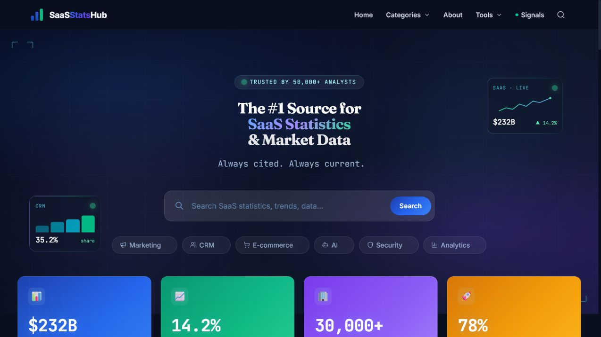

# SaaSStatsHub

[](https://github.com/Kannanyyd/saasstatshub/actions/workflows/ci.yml)
[](LICENSE)
[](https://saasstatshub.com)

SaaSStatsHub is an early-stage open-source platform for publishing structured SaaS statistics and research. It combines Astro, WordPress, WPGraphQL, and Cloudflare Pages into a reusable, low-cost architecture for independent developers.

I am the primary maintainer and handle development, reviews, releases, documentation, deployment, and security. Although the repository is still growing, it demonstrates how small teams can build useful public data platforms with limited infrastructure and operating budgets.



**Live product:** [saasstatshub.com](https://saasstatshub.com)

## Why SaaSStatsHub exists

Useful SaaS market data is scattered across vendor reports, investor relations pages, research firms, and government datasets. SaaSStatsHub provides a public interface for organizing that material into structured articles, category pages, source lists, and interactive tools.

The project also serves as a practical reference architecture for publishing a large, content-driven site without running an application server for every page view. WordPress remains the editorial system, while Astro turns the GraphQL content into static HTML served from Cloudflare Pages.

## Who this project is for

- Independent developers building public data or research products.
- Small teams evaluating Astro with a headless WordPress backend.
- Contributors interested in content provenance, structured data, and static-site performance.
- Researchers and SaaS practitioners who want transparent links back to original sources.

## Open-source use cases

You can use this repository to study or adapt:

- An Astro frontend backed by WordPress and WPGraphQL.
- Static generation for a large article and category archive.
- Typed transformations from CMS data to frontend components.
- Article features such as sources, quick overviews, takeaways, related content, and FAQ schema.
- Cloudflare Pages deployment, redirects, headers, RSS, sitemap, and Pagefind search.
- Standalone calculators and other public research tools.

The production WordPress database, editorial article library, private deployment configuration, and operational credentials are not included.

## Architecture

| Layer | Technology | Responsibility |
|---|---|---|
| Frontend | Astro 6, Tailwind CSS 4 | Pages, layouts, components, structured data |
| Content API | WordPress, WPGraphQL | Editorial content and custom fields |
| Build | Astro static generation, Pagefind | Static HTML and search index |
| Hosting | Cloudflare Pages | CDN delivery, headers, and redirects |

At build time, the frontend queries the configured GraphQL endpoint and generates static pages. When the CMS is unavailable during local development, the project can fall back to local mock data.

## Project layout

```text
src/
|-- components/       Reusable article and navigation components
|-- data/             Local fallback data and display defaults
|-- layouts/          Shared page and article layouts
|-- lib/              GraphQL client, schemas, transforms, and helpers
|-- pages/            Astro routes, including dynamic article routes
`-- styles/           Tailwind entry point and global design tokens
public/
|-- tools-static/     Standalone calculators and tools
|-- _headers          Cloudflare response headers
`-- _redirects        Cloudflare redirect rules
```

## Local development

Requirements:

- Node.js 22.12 or later
- npm

```bash
git clone https://github.com/Kannanyyd/saasstatshub.git
cd saasstatshub
npm ci
npm run dev
```

The local site is available at `http://localhost:4321`.

To use a WordPress GraphQL endpoint, create a local `.env` file:

```dotenv
WP_API_URL=https://cms.example.com/index.php?graphql
```

Do not commit credentials or private CMS URLs.

## Testing and build

```bash
npm run test:phase1
npm run build
npm run preview
```

The CI workflow runs dependency installation, the current Node test suite, and a production build for pull requests and pushes to `main`.

## Deployment

The production site is deployed to Cloudflare Pages. A standard production build writes output to `dist/`:

```bash
npm run build
npx wrangler pages deploy dist --project-name saasstatshub-git
```

Forks should configure their own CMS endpoint, Cloudflare project, domains, analytics, and secrets.

## Roadmap

Current maintenance priorities include:

- Expand automated tests for GraphQL transformations and generated metadata.
- Improve source provenance and editorial validation tooling.
- Document a reproducible local WordPress and WPGraphQL setup.
- Add accessibility and performance regression checks.
- Separate reusable publishing components from site-specific branding.
- Improve contributor documentation for calculators and structured datasets.

See [ROADMAP.md](ROADMAP.md) for scoped tasks that can become GitHub Issues.

## Contributing

Issues and pull requests are welcome. Start with [CONTRIBUTING.md](CONTRIBUTING.md), which explains setup, testing, content-source requirements, and the review process.

Good first contributions include documentation fixes, focused tests, accessibility improvements, and small bug fixes with a reproducible case. For larger changes, open an issue before investing significant implementation time.

## Security

Please do not report vulnerabilities in a public issue. Follow [SECURITY.md](SECURITY.md) for private reporting instructions and the supported-version policy.

## Project status

SaaSStatsHub is an early-stage project maintained primarily by one developer. APIs, schemas, and project structure may evolve. Roadmap entries describe intended work rather than delivery commitments.

## License

The source code in this repository is licensed under the [GNU Affero General Public License v3.0 only](LICENSE).

Third-party data, editorial article content, trademarks, logos, screenshots, and SaaSStatsHub website branding are not included in this license unless otherwise stated. The AGPL license requires operators of modified network-accessible versions to offer the corresponding source code to users of that service.
